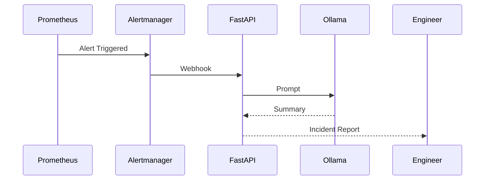
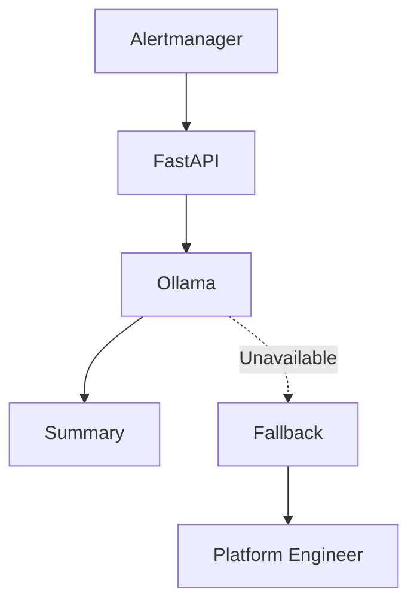

# AI Incident Engine

> This document describes the architecture, workflow, and implementation of the AI-assisted incident summarization service within the Valkyrie Platform.

---

# Table of Contents

1. Overview
2. Objectives
3. Design Principles
4. High-Level Architecture
5. Incident Processing Pipeline
6. Components
7. Prompt Engineering
8. Operational Flow

---

# Overview

The AI Incident Engine is an experimental operational component designed to assist engineers during incident response.

Rather than replacing operators, it automatically summarizes infrastructure alerts into concise, human-readable incident reports.

The objective is to reduce the time required to understand an incident by providing contextual summaries generated from operational telemetry.

The implementation intentionally uses a locally hosted language model to avoid sending operational data to external AI services.

---

# Objectives

The AI Incident Engine was built to explore practical applications of AI within modern Platform Engineering workflows.

Primary objectives include:

- Reduce alert fatigue
- Improve incident understanding
- Accelerate root-cause investigation
- Preserve operational privacy
- Demonstrate local AI inference

---

# Design Principles

The system follows several architectural principles.

## Human-in-the-Loop

The AI system assists engineers.

It does not make operational decisions.

Human operators remain responsible for validation and remediation.

---

## Local Inference

Inference is executed locally using Ollama.

Operational telemetry remains inside the platform.

Benefits include:

- Privacy
- Offline operation
- Reduced latency
- No dependency on external APIs

---

## Event Driven

Incident summaries are generated only when operational alerts occur.

No continuous inference workload exists.

---

## Deterministic Inputs

The AI model receives structured operational context rather than unrestricted access to the cluster.

This improves consistency and reduces hallucination risk.

---

# High-Level Architecture


---

# Incident Processing Pipeline

The incident workflow consists of six stages.

1. Prometheus evaluates alert rules.
2. Alertmanager triggers a webhook.
3. FastAPI receives the payload.
4. Prompt Builder formats operational context.
5. Ollama performs inference.
6. Summary returned to the engineer.

The AI engine never modifies Kubernetes resources.

Its responsibility is limited to summarization.

---

# Components

| Component | Responsibility |
|-----------|----------------|
| Prometheus | Metrics collection |
| Alertmanager | Alert routing |
| FastAPI | Webhook receiver |
| Prompt Builder | Context formatting |
| Ollama | Local inference |
| Platform Engineer | Incident validation |

---

# Prompt Engineering

Prompt quality directly affects summary quality.

The AI receives structured context such as:

- Alert name
- Severity
- Namespace
- Pod name
- Deployment
- Metric values
- Timestamp

Example prompt:

```text
Alert:
High CPU Usage

Namespace:
applications

Deployment:
frontend

Current CPU:
92%

Generate a concise operational summary including probable causes and recommended investigation steps.
```

Structured prompts produce more consistent outputs than free-form prompts.

---

# Operational Flow



The AI service is asynchronous and does not block alert delivery.

---

# Prompt Lifecycle

The quality of generated summaries depends primarily on the quality of the operational context provided to the language model.

The AI Incident Engine follows a structured prompt generation workflow.


The prompt builder intentionally limits input to structured operational metadata rather than providing unrestricted cluster access.

This approach improves consistency while reducing hallucination risk.

---

# Example Incident

## Incoming Alert

```yaml
alertname: HighCPUUsage

namespace: applications

deployment: frontend

severity: warning

cpu_usage: 94%
```

---

## Generated Summary

```
The frontend deployment is experiencing sustained CPU utilization above
90%.

The workload remains available, but prolonged utilization may increase
request latency.

Recommended investigation:

• Review recent deployments
• Inspect pod resource usage
• Verify autoscaling behaviour
• Review application logs
```

The generated summary serves as operational guidance.

Engineers remain responsible for diagnosis and remediation.

---

# Failure Handling

The AI Incident Engine should degrade gracefully if any component becomes unavailable.



If the inference service is unavailable:

- Alerts continue to flow.
- Platform monitoring remains operational.
- Engineers receive standard alerts.
- No deployment workflows are interrupted.

AI assistance is optional rather than a dependency.

---

# Performance Characteristics

The AI Incident Engine is designed for lightweight operational assistance.

Typical workflow characteristics include:

| Characteristic | Description |
|---------------|-------------|
| Trigger | Alertmanager Webhook |
| Processing | Event-driven |
| Inference | Local Ollama |
| Output | Human-readable summary |
| Deployment Model | Kubernetes |
| External Dependencies | None |

Performance depends on:

- Local hardware
- Model size
- Prompt complexity

---

# Security Considerations

The AI Incident Engine follows several security principles.

## Local Processing

Operational telemetry remains inside the Kubernetes environment.

No incident information is transmitted to external AI providers.

---

## Read-Only Context

The AI service receives operational context only.

It has no permission to:

- modify Kubernetes resources
- execute kubectl commands
- restart workloads
- change infrastructure

---

## Limited Scope

The AI system performs only one function:

Incident summarization.

Operational decision-making remains the responsibility of engineers.

---

# Known Limitations

Current limitations include:

- Experimental implementation
- No automated remediation
- No root cause verification
- No historical incident correlation
- No retrieval-augmented generation (RAG)
- No long-term operational memory
- Limited to structured alert context

These limitations are intentional to maintain predictability and transparency.

---

# Future Enhancements

Potential improvements include:

- Retrieval-Augmented Generation (RAG)
- Historical incident search
- Runbook recommendation
- Grafana dashboard context
- Loki log summarization
- Multi-model evaluation
- Slack or Microsoft Teams integration
- Incident timeline generation

Each enhancement should be evaluated against privacy, complexity, and operational value.

---

# Operational Best Practices

Recommended practices include:

- Keep prompts structured.
- Avoid exposing unnecessary operational data.
- Validate AI-generated recommendations.
- Use AI as an assistant, not an authority.
- Continuously review summary quality.
- Version-control prompt templates.

The effectiveness of the system depends more on prompt design than model size.

---

# Lessons Learned

Developing the AI Incident Engine highlighted several engineering insights.

- Structured prompts consistently outperform free-form prompts.
- Small local language models are sufficient for operational summarization.
- Operational context is more valuable than verbose alerts.
- AI should reduce cognitive load rather than automate decisions.
- Reliability and transparency are more important than creativity in operational tooling.

---

# Architecture Decisions

| Decision | Rationale |
|----------|-----------|
| Local inference | Preserve operational privacy |
| FastAPI | Lightweight webhook processing |
| Ollama | Offline inference capability |
| Structured prompts | Improve consistency |
| Human approval | Prevent unsafe automation |

These decisions prioritize reliability and operator trust over aggressive automation.

---

# Summary

The AI Incident Engine demonstrates how local language models can support platform operations without becoming part of the critical control plane.

Within Valkyrie:

- Prometheus detects operational issues.
- Alertmanager routes alerts.
- FastAPI prepares structured context.
- Ollama generates concise summaries.
- Platform Engineers investigate and resolve incidents.

The system is intentionally assistive rather than autonomous, preserving human oversight while reducing the effort required to understand operational events.

---
