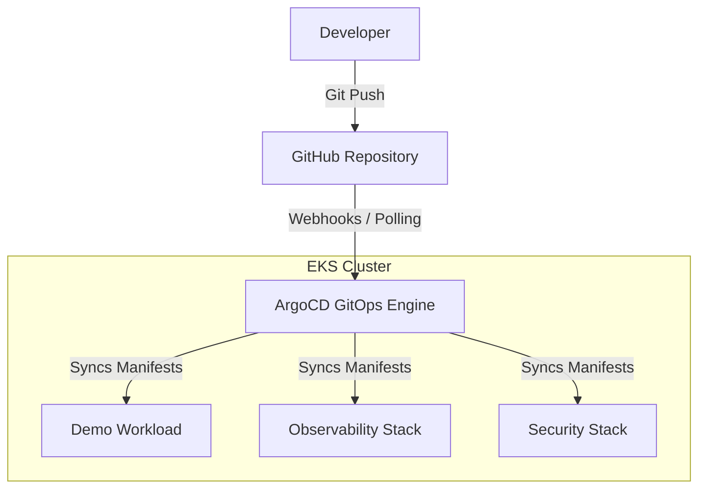
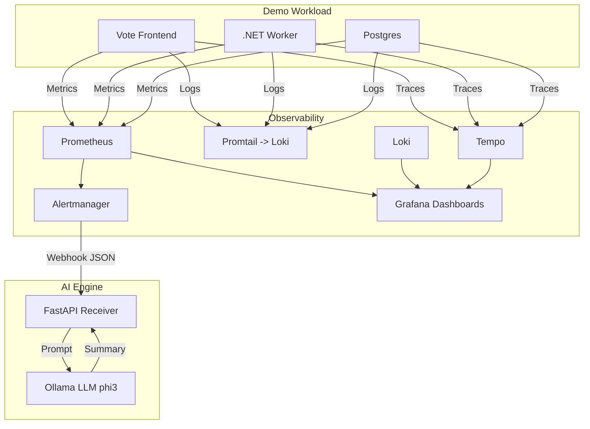
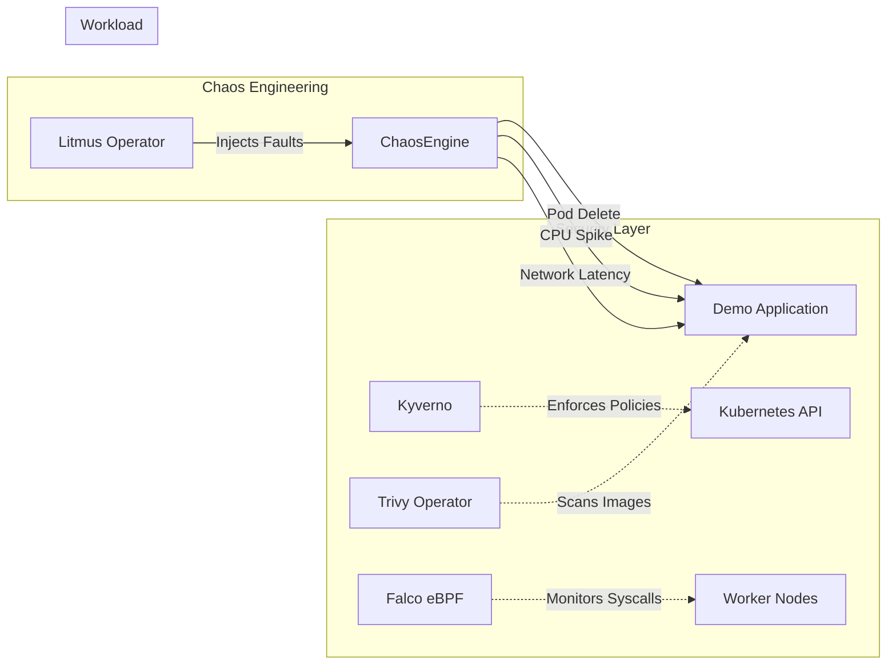

# Valkyrie Platform Architecture

The Valkyrie Platform is a production-grade, autonomous DevOps environment built on AWS EKS. It utilizes GitOps for declarative delivery, comprehensive observability, active security enforcement, chaos engineering, and local AI for automated incident summarization.

## Core Delivery Flow (GitOps)

All configuration and infrastructure changes are declarative and version-controlled. ArgoCD serves as the single source of truth, synchronizing the GitHub repository state to the EKS cluster using an "App of Apps" pattern.

## Observability & AI Incident Engine

When the workload generates telemetry, it is captured by the observability stack. If an alert threshold is breached, the incident is routed to a custom local AI engine for automated root-cause summarization.

## Security & Chaos Engineering

To ensure cluster resilience, security policies are actively enforced and faults are intentionally injected to validate the observability pipeline.

## Namespace Catalog

The platform is logically separated into the following namespaces:

| Namespace | Purpose | Key Components |
| :--- | :--- | :--- |
| `default` | Standard Kubernetes resources. | ExternalDNS |
| `argocd` | The GitOps delivery engine. | ArgoCD Server, Repo Server, App of Apps |
| `observability` | Telemetry collection and visualization. | Prometheus, Grafana, Loki, Tempo |
| `demo` | The primary application workload. | Voting App (Frontend, Worker, Redis, DB) |
| `trivy-system` | Vulnerability scanning. | Trivy Operator |
| `falco` | Runtime threat detection. | Falco DaemonSet |
| `kyverno` | Policy admission control. | Kyverno Admission Controller |
| `litmus` | Chaos engineering framework. | Litmus Operator, Chaos Runner |
| `ai` | Autonomous incident summarization. | Ollama, FastAPI Webhook |
| `backstage` | Developer portal and service catalog. | Backstage UI, PostgreSQL |
