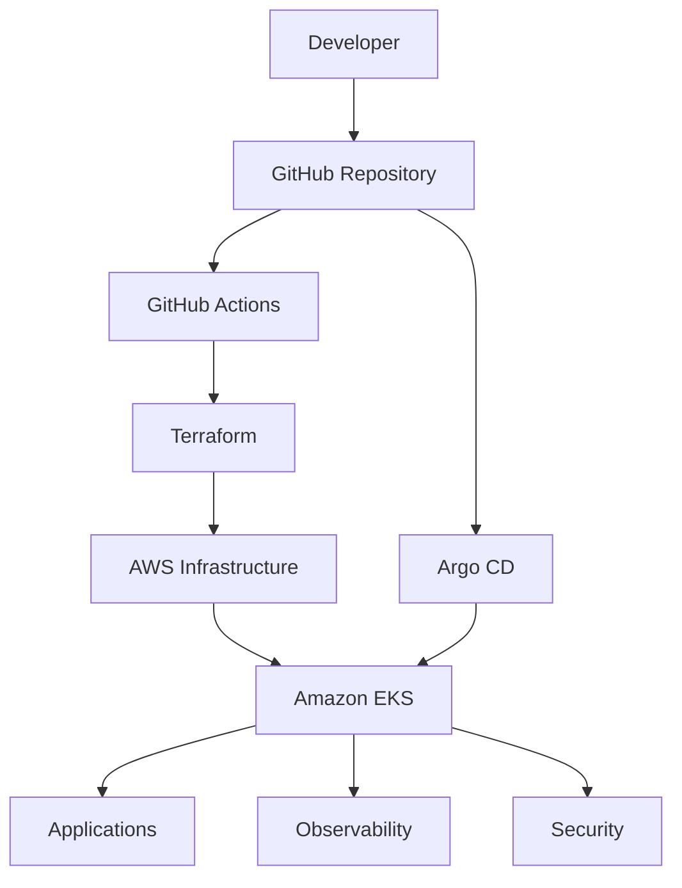
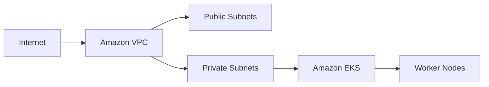
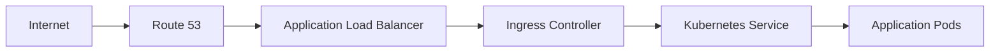
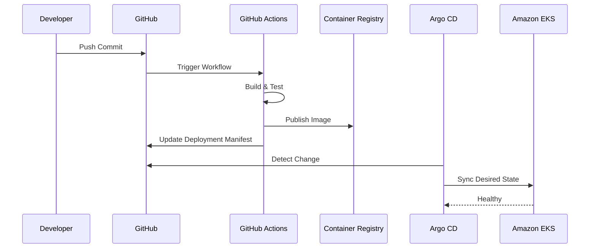
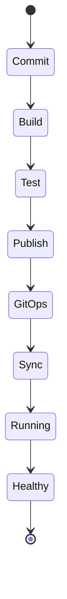
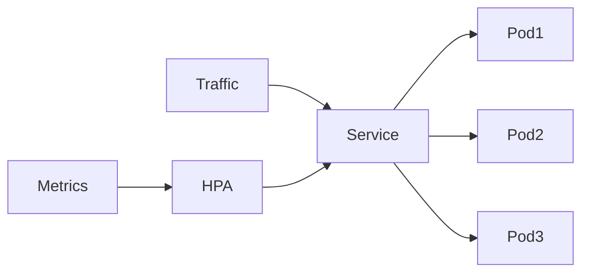

# Valkyrie Platform Architecture

> **Production-Style Platform Engineering on AWS**
>
> This document describes the architectural design, engineering principles, and component interactions that make up the Valkyrie Platform.

---

# Table of Contents

1. Executive Summary
2. Design Principles
3. High-Level Architecture
4. Platform Layers
5. Core Components
6. AWS Infrastructure
7. Kubernetes Platform
8. Documentation References

---

# Executive Summary

Valkyrie Platform is a cloud-native reference platform that demonstrates how modern Platform Engineering practices can be implemented on Amazon Web Services (AWS) using Kubernetes, Infrastructure as Code (IaC), GitOps, and a comprehensive observability stack.

Unlike repositories focused on a single technology, Valkyrie integrates multiple operational domains into a unified platform:

- Infrastructure provisioning
- Kubernetes orchestration
- Continuous delivery
- Observability
- Security
- Reliability
- Operational automation

The project is intended to model engineering practices commonly found in production environments while remaining approachable for learning and experimentation.

---

# Design Principles

The architecture follows several guiding principles.

## Infrastructure as Code

Every cloud resource is provisioned through Terraform.

Infrastructure is:

- Declarative
- Version controlled
- Repeatable
- Reviewable

Manual provisioning is intentionally avoided.

---

## Git as the Source of Truth

All platform configuration is stored in Git.

Git becomes the authoritative definition of:

- Infrastructure
- Kubernetes resources
- Platform services
- Application deployments

Argo CD continuously reconciles cluster state against repository state.

---

## Platform over Individual Tools

The objective is not to demonstrate isolated technologies.

Instead, Valkyrie focuses on how infrastructure, deployment, monitoring, security, and operations integrate into a cohesive platform.

---

## Observability by Default

Every platform component should produce telemetry.

Metrics, logs, traces, and alerts are treated as first-class operational concerns.

---

## Automation First

Operational tasks should be automated wherever practical.

Examples include:

- Infrastructure provisioning
- Application deployment
- Cluster reconciliation
- Monitoring
- Incident notification

---

# High-Level Architecture



---

# Platform Layers

The platform is organized into independent layers.

| Layer | Responsibility |
|--------|----------------|
| Infrastructure | AWS networking, compute, IAM, storage |
| Kubernetes | Cluster lifecycle and orchestration |
| GitOps | Declarative deployment and synchronization |
| CI | Build, test, and image publication |
| Observability | Metrics, logs, dashboards, alerting |
| Security | Vulnerability scanning and policy enforcement |
| Applications | Platform workloads and sample services |

Each layer is independently deployable while remaining part of the overall platform.

---

# Core Components

| Component | Purpose |
|-----------|---------|
| Terraform | Infrastructure provisioning |
| Amazon EKS | Kubernetes control plane |
| Kubernetes | Container orchestration |
| Helm | Application packaging |
| GitHub Actions | Continuous Integration |
| Argo CD | GitOps deployment |
| Prometheus | Metrics collection |
| Grafana | Visualization |
| Loki | Log aggregation |
| Alertmanager | Alert routing |
| Trivy | Vulnerability scanning |

> Additional integrations such as Falco, Kyverno, AI-assisted incident analysis, or Backstage should only be documented here if they are implemented in the repository. Otherwise, list them in the roadmap rather than the architecture.

---

# AWS Infrastructure

The AWS layer provides the foundational cloud resources required by the platform.



The infrastructure is provisioned using Terraform modules to ensure consistency across deployments.

Typical resources include:

- VPC
- Public and private subnets
- Internet Gateway
- Route Tables
- Security Groups
- IAM Roles
- Amazon EKS Cluster
- Managed Node Groups

---

# Kubernetes Platform

Amazon EKS hosts the platform workloads.

Logical separation is achieved through Kubernetes namespaces.

Typical namespaces include:

| Namespace | Responsibility |
|-----------|----------------|
| argocd | GitOps controller |
| monitoring | Prometheus and Grafana |
| logging | Loki components |
| applications | Sample workloads |
| ingress | Ingress controller (if used) |

Namespace isolation improves:

- RBAC
- Resource allocation
- Operational ownership
- Security boundaries

---

# Documentation References

The following documents expand on specific platform areas.

| Document | Description |
|----------|-------------|
| DEPLOYMENT.md | Installation and deployment |
| TERRAFORM.md | Infrastructure modules |
| KUBERNETES.md | Cluster architecture |
| GITOPS.md | GitOps workflows |
| OBSERVABILITY.md | Metrics, logs, dashboards |
| SECURITY.md | Security model |
| ROADMAP.md | Planned enhancements |

---
# Kubernetes Networking Architecture

The networking model follows standard Kubernetes networking principles where every Pod receives its own IP address and can communicate with other Pods without Network Address Translation (NAT).

Traffic entering the platform follows multiple layers before reaching application workloads.



---

## Traffic Flow

Incoming traffic follows this lifecycle:

1. Client requests are resolved through Route 53.
2. Requests reach the Application Load Balancer.
3. The Ingress Controller performs routing.
4. Traffic is forwarded to Kubernetes Services.
5. Services distribute requests across healthy Pods.

This separation enables:

- Layer 7 routing
- Load balancing
- Service discovery
- Rolling deployments
- Zero-downtime updates

---

# GitOps Architecture

Valkyrie adopts a pull-based GitOps workflow.

Rather than CI/CD directly deploying workloads, Git defines the desired platform state while Argo CD continuously reconciles Kubernetes against the repository.



---

## Why Pull-Based GitOps?

GitOps provides several operational advantages over push-based deployment pipelines.

| GitOps Capability | Operational Benefit |
|-------------------|---------------------|
| Continuous Reconciliation | Prevents configuration drift |
| Git History | Auditable change history |
| Rollback | Simple Git revert |
| Desired State | Declarative infrastructure |
| Drift Detection | Automatic recovery |

---

# Continuous Integration

GitHub Actions performs Continuous Integration before any deployment occurs.

Pipeline stages include:

```text
Source Code
      │
      ▼
Static Analysis
      │
      ▼
Unit Tests
      │
      ▼
Container Build
      │
      ▼
Container Scan
      │
      ▼
Image Publish
      │
      ▼
Manifest Update
```

Typical responsibilities include:

- Source validation
- Dependency installation
- Container image creation
- Vulnerability scanning
- Image publication
- Deployment manifest updates

---

# Deployment Lifecycle

Every application deployment follows the same lifecycle.



This workflow minimizes manual intervention while ensuring deployments remain reproducible.

---

# Failure Domains

The platform separates infrastructure into independent failure domains to reduce operational risk.

| Layer | Failure Impact |
|--------|----------------|
| GitHub | CI/CD unavailable |
| Container Registry | New images unavailable |
| Argo CD | Synchronization paused |
| Kubernetes Node | Workloads rescheduled |
| Application Pod | Replica restarted |
| Monitoring | Reduced observability |

Failures within one layer should not automatically cascade into unrelated platform components.

---

# High Availability

Platform services are designed to support high availability where practical.

Recommended practices include:

- Multiple worker nodes
- ReplicaSets for workloads
- Kubernetes health probes
- Rolling updates
- Pod disruption budgets
- Multiple Availability Zones
- Load-balanced ingress

> The reference implementation demonstrates these patterns where applicable, though specific redundancy depends on the deployed environment.

---

# Scaling Strategy

Kubernetes provides horizontal scaling for platform workloads.



Scaling decisions are typically based on:

- CPU utilization
- Memory utilization
- Custom application metrics

Future enhancements may include Cluster Autoscaler or Karpenter for node-level scaling.

---

# Platform Resilience

The platform is designed around several resilience principles.

| Principle | Implementation |
|-----------|----------------|
| Infrastructure Recovery | Terraform |
| Application Recovery | Kubernetes ReplicaSets |
| Deployment Recovery | GitOps rollback |
| Configuration Recovery | Git repository |
| Monitoring | Prometheus + Alertmanager |
| Logging | Loki |
| Incident Response | Alerting workflow |

---

# Architecture Decisions

The platform intentionally favors declarative operations over imperative administration.

Key architectural decisions include:

| Decision | Rationale |
|----------|-----------|
| Terraform | Infrastructure as Code |
| GitOps | Declarative deployments |
| Kubernetes | Container orchestration |
| Helm | Repeatable application packaging |
| Prometheus | Native Kubernetes monitoring |
| Grafana | Unified visualization |
| Loki | Lightweight log aggregation |

These decisions emphasize repeatability, operational consistency, and maintainability over manual administration.
