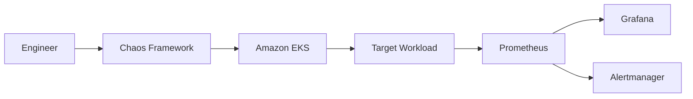
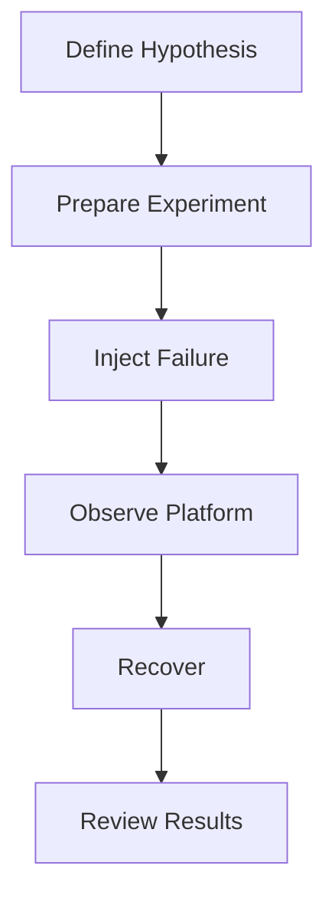
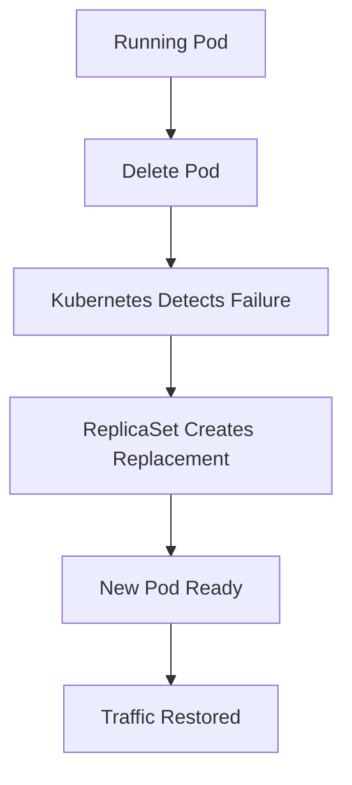
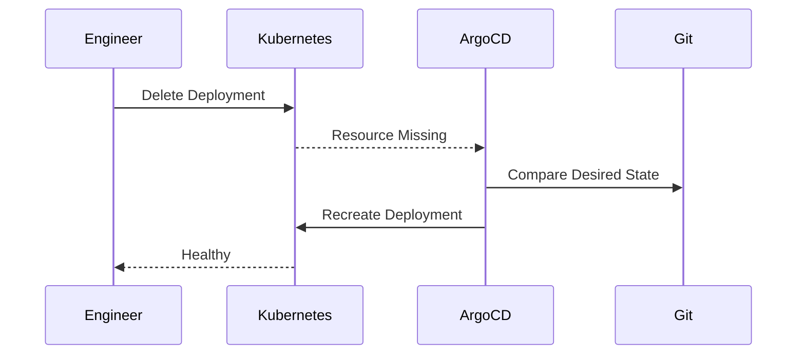
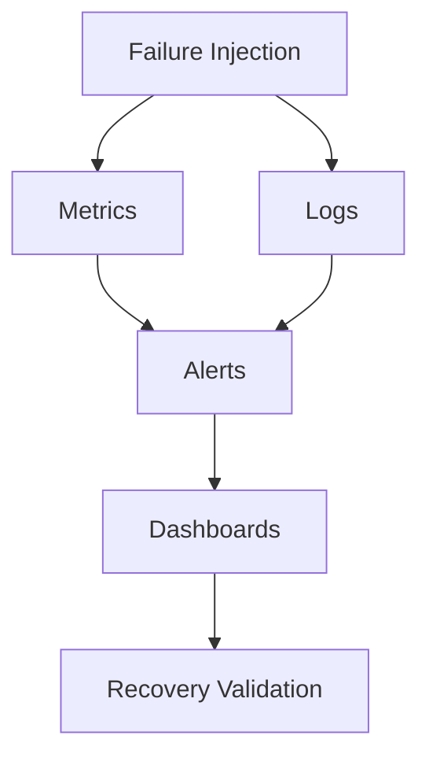

# Chaos Engineering

> This document describes the chaos engineering strategy used by the Valkyrie Platform to validate resilience, recovery mechanisms, and operational readiness.

---

# Table of Contents

1. Overview
2. Why Chaos Engineering?
3. Design Principles
4. Architecture
5. Failure Categories
6. Experiment Lifecycle
7. Safety Controls

---

# Overview

Chaos Engineering is the disciplined practice of intentionally introducing failures into a system to validate that it behaves as expected under adverse conditions.

Within Valkyrie, chaos experiments are used to verify:

- Kubernetes self-healing
- Deployment resilience
- Monitoring and alerting
- GitOps reconciliation
- Operational response procedures

The objective is not to break the platform, but to improve confidence in its ability to recover from failure.

---

# Why Chaos Engineering?

Distributed systems fail in unexpected ways.

Hardware fails.

Pods crash.

Nodes become unavailable.

Network latency increases.

Storage becomes unavailable.

Rather than assuming recovery mechanisms work, Valkyrie validates them through controlled experiments.

---

# Engineering Principles

Chaos experiments should follow several principles.

## Controlled

Experiments are executed in isolated environments.

Production systems should never be impacted unintentionally.

---

## Observable

Every experiment must generate telemetry.

Metrics, logs, and alerts should confirm both failure and recovery.

---

## Repeatable

Experiments should produce consistent outcomes.

Results should be reproducible through version-controlled definitions.

---

## Safe

Every experiment must define:

- Scope
- Duration
- Expected impact
- Recovery criteria
- Rollback plan

---

# Chaos Architecture



If you use LitmusChaos, replace **Chaos Framework** with **LitmusChaos**.

---

# Failure Categories

Chaos experiments can target different failure domains.

| Category | Example |
|----------|----------|
| Pod Failure | Delete running Pod |
| Node Failure | Drain or terminate worker node |
| CPU Stress | Artificial CPU load |
| Memory Stress | Memory exhaustion |
| Disk Failure | Storage pressure |
| Network Delay | Increased latency |
| Packet Loss | Network instability |

Only document categories implemented in the repository.

---

# Experiment Lifecycle

Every experiment follows the same operational lifecycle.



Each experiment begins with a hypothesis describing the expected system behavior.

Example:

> If a frontend Pod is deleted, Kubernetes should recreate it automatically and service availability should remain uninterrupted.

---

# Safety Controls

To reduce operational risk, chaos experiments should include safeguards.

Recommended controls include:

- Target namespace restrictions
- Time limits
- Automatic cleanup
- Resource selection filters
- Approval before execution
- Continuous monitoring during experiments

These controls ensure experiments remain predictable and reversible.

---

# Success Criteria

An experiment is considered successful when:

- The failure is injected successfully.
- Monitoring detects the event.
- Alerts are generated (if expected).
- Kubernetes recovers the workload.
- Service availability remains acceptable.
- Engineers can verify recovery using telemetry.

Recovery is as important as failure injection.

---

# Pod Failure Experiment

Pod failure is one of the most common operational events in Kubernetes.

This experiment validates Kubernetes self-healing and service continuity.

## Objective

Verify that Kubernetes automatically recreates failed Pods while maintaining application availability.

## Experiment Workflow



## Expected Results

- Pod termination detected.
- Replacement Pod scheduled.
- Readiness probe succeeds.
- Service endpoints updated.
- Application remains available.

---

# Example Validation

Delete a Pod.

```bash
kubectl delete pod <pod-name> -n applications
```

Observe recovery.

```bash
kubectl get pods -w -n applications
```

Verify service endpoints.

```bash
kubectl get endpoints -n applications
```

Expected outcome:

- Original Pod removed.
- Replacement Pod created.
- Service continues routing traffic.

---

# Node Failure Validation

If multiple worker nodes are available, Kubernetes should reschedule workloads after node failure.

## Objective

Validate workload rescheduling and platform resilience during node loss.


Expected behavior:

- Node becomes NotReady.
- Pods are rescheduled.
- Services recover automatically.

If this experiment has not been executed in Valkyrie, classify it as a planned validation rather than an implemented test.

---

# CPU Stress Experiment

CPU stress testing validates:

- Resource limits
- Horizontal scaling (if configured)
- Scheduler behavior
- Alerting thresholds

Typical workflow:


Expected observations:

- CPU metrics increase.
- Alerts trigger when thresholds are exceeded.
- Application remains stable or scales according to configuration.

---

# Memory Pressure Experiment

Memory exhaustion tests workload behavior under resource constraints.

Objectives:

- Verify OOM handling.
- Confirm restart behavior.
- Validate monitoring.
- Observe recovery.

Expected Kubernetes events:

- OOMKilled
- Pod restart
- Alert generation

---

# GitOps Recovery Validation

GitOps should restore resources removed outside the deployment workflow.

## Example

Delete a Deployment.

```bash
kubectl delete deployment frontend -n applications
```

Expected recovery:



This validates Argo CD's reconciliation loop.

---

# Observability During Chaos

Every experiment should generate telemetry.

Operators should observe:

- Pod lifecycle
- CPU utilization
- Memory usage
- Restart counts
- Alert generation
- Event logs

Recommended workflow:



---

# Recovery Metrics

Recovery should be measured objectively.

Typical metrics include:

| Metric | Description |
|---------|-------------|
| Detection Time | Time to identify failure |
| Recovery Time | Time until workload restored |
| MTTR | Mean Time To Recovery |
| Availability | User-visible uptime |
| Restart Count | Number of restarted Pods |

Recording these metrics helps compare resilience improvements over time.

---

# Lessons Learned

Chaos engineering reinforces several operational principles:

- Failures are inevitable.
- Recovery should be automated.
- Monitoring must provide actionable context.
- GitOps reduces recovery complexity.
- Repeatable experiments build operational confidence.

---

# Future Experiments

Potential additions include:

- Network latency injection
- Packet loss simulation
- DNS failure testing
- Storage failure scenarios
- Availability Zone failure
- Control plane outage simulation
- Multi-service dependency failures

These experiments should be introduced incrementally and validated in isolated environments.

---

# Operational Best Practices

- Define a clear hypothesis before each experiment.
- Limit the scope of every test.
- Monitor the platform throughout execution.
- Verify recovery before concluding the experiment.
- Record observations and metrics.
- Automate repeatable experiments where practical.

---

# Summary

Chaos Engineering complements GitOps, Kubernetes, and Observability by validating that recovery mechanisms work under real failure conditions.

Within Valkyrie:

- Kubernetes provides self-healing.
- GitOps restores desired state.
- Prometheus and Grafana expose recovery metrics.
- Alertmanager surfaces operational impact.

Together, these capabilities improve confidence in the platform's resilience and operational readiness.

---
