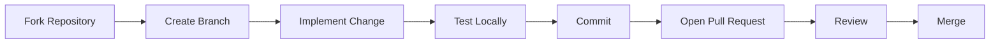

# Contributing to Valkyrie Platform

First, thank you for your interest in contributing to the Valkyrie Platform.

This project serves as a production-style Platform Engineering reference implementation focused on Infrastructure as Code, GitOps, Kubernetes, Observability, Security, and Site Reliability Engineering (SRE).

Whether you are fixing a bug, improving documentation, or adding a new platform capability, contributions are welcome.

---

# Table of Contents

1. Getting Started
2. Development Principles
3. Repository Structure
4. Development Workflow
5. Commit Guidelines
6. Pull Request Process
7. Coding Standards
8. Documentation Standards
9. Issue Reporting
10. License

---

# Getting Started

## Clone the Repository

```bash
git clone https://github.com/kunal-1207/valkyrie_platform.git

cd valkyrie_platform
```

---

## Create a Branch

```bash
git checkout -b feature/my-feature
```

Branch naming examples:

```
feature/add-ingress

feature/prometheus-dashboard

bugfix/terraform-state

docs/update-architecture

security/trivy-scan
```

---

# Development Principles

All contributions should follow the platform philosophy.

We value:

- Declarative Infrastructure
- Infrastructure as Code
- GitOps
- Automation
- Security by Design
- Observability
- Simplicity
- Reproducibility

Every change should improve the platform without increasing unnecessary complexity.

---

# Repository Structure

```
docs/
    Architecture
    Deployment
    Security
    GitOps
    Kubernetes
    Observability

infrastructure/
    terraform/

platform/
    argocd/
    monitoring/
    security/

applications/

scripts/

.github/
```

Please place new files in the appropriate directory.

---

# Development Workflow

Typical contribution workflow:



---

# Before Opening a Pull Request

Verify:

- Terraform formatting passes.
- Kubernetes manifests validate.
- Helm charts render correctly.
- Documentation is updated.
- Markdown formatting is correct.
- Existing functionality remains unaffected.

---

# Commit Guidelines

Use meaningful commit messages.

Good examples:

```
feat(terraform): add EKS node group

fix(argocd): resolve sync issue

docs(architecture): update deployment diagram

security: add Trivy scan workflow

observability: improve Grafana dashboards
```

Avoid messages such as:

```
update

fix

changes

testing

final
```

---

# Pull Request Checklist

Before submitting a Pull Request ensure:

- [ ] Code builds successfully
- [ ] Documentation updated
- [ ] New resources documented
- [ ] Existing functionality tested
- [ ] No unnecessary files committed

---

# Infrastructure Changes

Infrastructure contributions should:

- Follow Terraform best practices.
- Avoid hard-coded values.
- Support reproducible deployments.
- Minimize unnecessary resources.

Run:

```bash
terraform fmt

terraform validate
```

before committing.

---

# Kubernetes Changes

When modifying Kubernetes resources:

Verify:

- resource requests
- resource limits
- labels
- probes
- namespaces
- RBAC

Avoid using the `default` namespace unless explicitly required.

---

# GitOps Changes

Changes affecting Argo CD should:

- remain declarative
- preserve idempotency
- avoid manual synchronization requirements

Always validate manifests before committing.

---

# Documentation Standards

Documentation is considered part of the platform.

Every new feature should include:

- Architecture explanation
- Deployment instructions
- Operational considerations
- Troubleshooting guidance (if applicable)

Use Markdown consistently.

---

# Reporting Issues

When opening an issue include:

- Platform version
- Kubernetes version
- AWS region
- Error messages
- Relevant logs
- Reproduction steps

Providing complete information helps reproduce and resolve problems more quickly.

---

# Code of Conduct

Please:

- Be respectful.
- Assume positive intent.
- Provide constructive feedback.
- Focus discussions on technical improvements.

---

# License

By contributing, you agree that your contributions will be licensed under the MIT License.

---

# Thank You

Thank you for helping improve the Valkyrie Platform.

Contributions that improve reliability, security, observability, automation, or developer experience are always appreciated.
