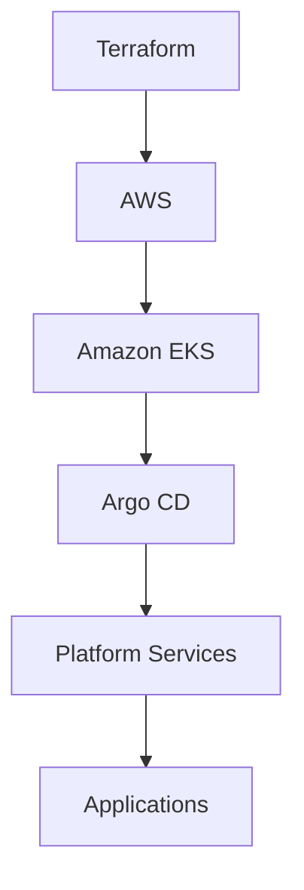
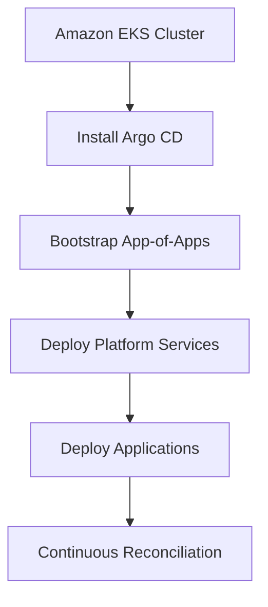
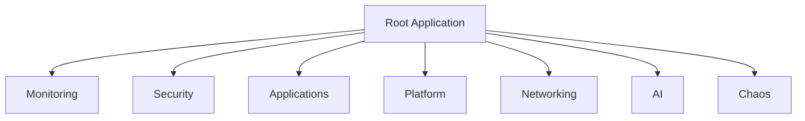

# Deployment Guide

> This document describes the end-to-end deployment workflow for the Valkyrie Platform, from infrastructure provisioning through GitOps bootstrap and platform validation.

---

# Table of Contents

1. Overview
2. Deployment Architecture
3. Prerequisites
4. Environment Requirements
5. AWS Infrastructure Provisioning
6. Kubernetes Configuration
7. GitOps Bootstrap
8. Platform Validation

---

# Overview

Valkyrie follows a layered deployment model.

Rather than deploying everything simultaneously, the platform is built progressively through independent infrastructure and application layers.

```text
Infrastructure
        │
        ▼
Amazon EKS
        │
        ▼
GitOps Controller
        │
        ▼
Platform Services
        │
        ▼
Applications
        │
        ▼
Monitoring
        │
        ▼
Security
```

Each layer is deployed independently while remaining fully declarative.

---

# Deployment Philosophy

The deployment process follows several engineering principles.

## Infrastructure First

Infrastructure is provisioned before Kubernetes resources exist.

Terraform owns:

- Networking
- IAM
- EKS
- Node Groups

---

## GitOps Controls Kubernetes

Once the cluster exists, Kubernetes resources are never deployed manually.

Argo CD becomes responsible for:

- Namespaces
- Helm Charts
- Platform Services
- Applications

---

## Immutable Deployments

Infrastructure changes are applied through Terraform.

Application changes are applied through Git.

Manual kubectl changes are discouraged.

---

# Deployment Architecture



---

# Prerequisites

Before deployment, ensure the following software is installed.

| Tool | Recommended Version |
|-------|---------------------|
| AWS CLI | v2.x |
| Terraform | >=1.6 |
| kubectl | Latest stable |
| Helm | v3.x |
| Git | Latest |
| Docker | Latest |
| Argo CD CLI | Latest (optional) |

Verify installations.

```bash
aws --version
terraform version
kubectl version --client
helm version
docker version
git --version
```

---

# AWS Requirements

Deployment requires an AWS account with permissions to create:

- VPC
- IAM Roles
- Security Groups
- EKS Cluster
- EC2
- Load Balancer
- Route Tables
- Internet Gateway

Recommended Region

```
us-east-1
```

Configure credentials.

```bash
aws configure
```

Verify identity.

```bash
aws sts get-caller-identity
```

---

# Repository Setup

Clone the repository.

```bash
git clone https://github.com/kunal-1207/valkarie_platform.git

cd valkarie_platform
```

Review repository structure.

```text
infrastructure/
kubernetes/
argocd/
monitoring/
security/
applications/
scripts/
docs/
```

---

# Infrastructure Provisioning

Navigate to the Terraform directory.

```bash
cd infrastructure/terraform
```

Initialize Terraform.

```bash
terraform init
```

Review the execution plan.

```bash
terraform plan
```

Provision infrastructure.

```bash
terraform apply
```

Terraform creates resources including:

- Amazon VPC
- Public Subnets
- Private Subnets
- IAM Roles
- Security Groups
- Amazon EKS
- Managed Node Groups

---

# Configure kubectl

Retrieve cluster credentials.

```bash
aws eks update-kubeconfig \
  --region us-east-1 \
  --name valkyrie-cluster
```

Verify cluster connectivity.

```bash
kubectl cluster-info

kubectl get nodes

kubectl get namespaces
```

Expected output should include Ready worker nodes.

---

# Verify Infrastructure

Confirm:

```bash
kubectl get nodes

kubectl get storageclass

kubectl get svc

kubectl get namespaces
```

Expected result:

- Worker nodes Ready
- StorageClass Available
- Default namespaces created

Infrastructure deployment is now complete.

The next step is bootstrapping the GitOps platform.

---

# GitOps Bootstrap

Once the Kubernetes cluster is available, the platform transitions from infrastructure provisioning to declarative application management.

Argo CD becomes the control plane responsible for synchronizing the desired state stored in Git with the actual state running inside the Kubernetes cluster.

No platform components should be deployed manually after GitOps has been initialized.

---

# Bootstrap Workflow



---

# Install Argo CD

Create the Argo CD namespace.

```bash
kubectl create namespace argocd
```

Install the official manifests.

```bash
kubectl apply \
-n argocd \
-f https://raw.githubusercontent.com/argoproj/argo-cd/stable/manifests/install.yaml
```

Wait for the deployment to complete.

```bash
kubectl wait \
--for=condition=available \
deployment/argocd-server \
-n argocd \
--timeout=300s
```

Verify installation.

```bash
kubectl get pods -n argocd
```

Expected status:

```
Running
```

for all Argo CD components.

---

# Access the Argo CD UI

Forward the Argo CD server.

```bash
kubectl port-forward svc/argocd-server \
-n argocd \
8080:443
```

Retrieve the initial administrator password.

```bash
kubectl \
-n argocd \
get secret argocd-initial-admin-secret \
-o jsonpath="{.data.password}" \
| base64 -d
```

Login.

```
https://localhost:8080
```

Username

```
admin
```

Password

```
<decoded secret>
```

---

# App-of-Apps Pattern

Valkyrie adopts the App-of-Apps deployment model.

Rather than deploying every application individually, a single root application manages all platform components.



Advantages include:

- Centralized management
- Simplified onboarding
- Consistent synchronization
- Easier disaster recovery

---

# Bootstrap Root Application

Deploy the root Argo CD application.

```bash
kubectl apply \
-f argocd/app-of-apps/root-application.yaml
```

Verify synchronization.

```bash
kubectl get applications \
-n argocd
```

Expected result:

```
Synced

Healthy
```

---

# Synchronization Process

Once the root application is created, Argo CD automatically deploys all child applications.

Typical deployment order:

1. Namespaces
2. Platform Services
3. Monitoring
4. Logging
5. Security
6. Applications
7. AI Services

Synchronization is continuous.

Every Git commit becomes the desired platform state.

---

# Platform Components

The following platform services are managed through GitOps.

| Component | Deployment Method |
|------------|------------------|
| Prometheus | Helm |
| Grafana | Helm |
| Loki | Helm |
| Alertmanager | Helm |
| Trivy | Kubernetes Manifest |
| Argo CD | Kubernetes Manifest |
| Demo Applications | Kubernetes Manifest |

Additional services such as Falco, Kyverno, Backstage, LitmusChaos, or the AI Incident Engine should be included here only if they are deployed through the repository.

---

# Validate GitOps

Confirm all applications are synchronized.

```bash
kubectl get applications \
-n argocd
```

Verify namespaces.

```bash
kubectl get namespaces
```

Expected namespaces include:

```
argocd
monitoring
logging
applications
```

Verify workloads.

```bash
kubectl get pods \
-A
```

Every pod should eventually report:

```
Running
```

or

```
Completed
```

---

# Health Verification

Check cluster health.

```bash
kubectl get nodes
```

Verify workloads.

```bash
kubectl get deployments \
-A
```

Inspect services.

```bash
kubectl get svc \
-A
```

Confirm ingress resources.

```bash
kubectl get ingress \
-A
```

Review Argo CD synchronization status.

```bash
argocd app list
```

Healthy output should report:

- Healthy
- Synced
- No OutOfSync resources

---

# Common Bootstrap Issues

| Problem | Possible Cause | Resolution |
|----------|----------------|------------|
| Pods Pending | Insufficient cluster resources | Increase node capacity |
| Application OutOfSync | Repository state differs | Refresh or Sync application |
| ImagePullBackOff | Missing image or registry authentication | Verify container image and credentials |
| CrashLoopBackOff | Configuration or application error | Inspect pod logs |
| Ingress unavailable | Ingress controller not deployed | Verify ingress installation |

---

# Rollback Strategy

GitOps simplifies rollback operations.

If an invalid deployment is introduced:

1. Revert the Git commit.
2. Push the corrected commit.
3. Argo CD detects the change.
4. The cluster automatically reconciles to the previous known-good state.

No manual Kubernetes changes are required.

---

# Platform Ready

At this stage, the following components should be operational:

- Amazon EKS
- Argo CD
- GitOps synchronization
- Platform namespaces
- Monitoring stack
- Logging stack
- Security components
- Application workloads

The platform is now ready for operational validation, monitoring, and ongoing development.

---
---

# Post-Deployment Validation

After the platform has been deployed successfully, perform the following validation steps to ensure that all platform components are operating correctly.

---

# Infrastructure Validation

Verify the Kubernetes cluster.

```bash
kubectl cluster-info
```

Verify worker nodes.

```bash
kubectl get nodes -o wide
```

Expected:

- All nodes report **Ready**
- Internal IP addresses assigned
- Correct Kubernetes version

---

Verify namespaces.

```bash
kubectl get ns
```

Expected namespaces include:

```
argocd
monitoring
logging
applications
security
```

Additional namespaces may be present depending on enabled platform features.

---

# Application Validation

Verify deployments.

```bash
kubectl get deploy -A
```

Verify ReplicaSets.

```bash
kubectl get rs -A
```

Verify Pods.

```bash
kubectl get pods -A
```

Expected state:

```
Running

Completed
```

No workload should remain in:

```
Pending

CrashLoopBackOff

ImagePullBackOff

Error
```

---

# Service Validation

Verify Services.

```bash
kubectl get svc -A
```

Confirm that ClusterIP and LoadBalancer services are created as expected.

---

Verify Ingress resources.

```bash
kubectl get ingress -A
```

If AWS Load Balancer Controller is used, confirm that an Application Load Balancer has been provisioned.

---

# GitOps Validation

Confirm that all Argo CD applications are synchronized.

```bash
argocd app list
```

Expected status:

```
Healthy

Synced
```

Review application details.

```bash
argocd app get <application-name>
```

---

# Observability Validation

Verify Prometheus.

```bash
kubectl get pods -n monitoring
```

Port-forward Prometheus.

```bash
kubectl port-forward svc/prometheus-server \
-n monitoring \
9090:80
```

Visit

```
http://localhost:9090
```

Confirm:

- Targets are UP
- Metrics are being scraped
- Alert rules are loaded

---

Verify Grafana.

```bash
kubectl port-forward svc/grafana \
-n monitoring \
3000:80
```

Visit

```
http://localhost:3000
```

Validate:

- Dashboards load successfully
- Prometheus datasource is connected
- Metrics populate correctly

---

Verify Loki.

Execute sample queries within Grafana Explore.

Confirm that application logs are visible.

---

# Security Validation

If Trivy Operator is enabled:

```bash
kubectl get vulnerabilityreports -A
```

Confirm that vulnerability reports are generated for deployed workloads.

---

If Kyverno is enabled:

```bash
kubectl get cpol
```

Ensure ClusterPolicies are active.

---

If Falco is enabled:

```bash
kubectl get pods -n falco
```

Verify Falco is running on worker nodes.

---

# Platform Health Checklist

| Validation | Status |
|------------|---------|
| Infrastructure Provisioned | ✅ |
| Kubernetes Healthy | ✅ |
| Nodes Ready | ✅ |
| GitOps Synced | ✅ |
| Monitoring Active | ✅ |
| Logging Active | ✅ |
| Security Components Running | ✅ |
| Applications Running | ✅ |

---

# Upgrade Strategy

Platform upgrades should be performed incrementally.

Recommended sequence:

1. Backup Terraform state.
2. Upgrade Terraform modules.
3. Upgrade Amazon EKS control plane.
4. Upgrade managed node groups.
5. Upgrade Kubernetes add-ons.
6. Upgrade Helm releases.
7. Upgrade Argo CD.
8. Upgrade monitoring components.
9. Upgrade applications.

Avoid upgrading multiple platform layers simultaneously.

---

# Backup Strategy

The platform should regularly back up:

- Terraform remote state
- Git repositories
- Kubernetes manifests
- Secrets (encrypted)
- Persistent Volumes
- Grafana dashboards

Future enhancements may integrate Velero for automated Kubernetes backup and restore.

---

# Disaster Recovery

Recovery priorities:

## Infrastructure

Recreate infrastructure from Terraform.

```bash
terraform apply
```

---

## Kubernetes

Reconnect kubectl.

```bash
aws eks update-kubeconfig \
--region us-east-1 \
--name valkyrie-cluster
```

---

## Platform

Bootstrap GitOps.

```bash
kubectl apply \
-f argocd/app-of-apps/root.yaml
```

Argo CD automatically restores platform resources from Git.

---

# Platform Teardown

To destroy the platform:

Delete GitOps-managed applications.

```bash
argocd app delete --all
```

Destroy infrastructure.

```bash
cd infrastructure/terraform

terraform destroy
```

Confirm that:

- Load Balancers are removed
- EKS cluster is deleted
- Security Groups are removed
- VPC resources are cleaned up

---

# Operational Best Practices

- Never modify Kubernetes resources manually.
- Treat Git as the single source of truth.
- Review Terraform plans before applying.
- Monitor cluster health continuously.
- Rotate credentials regularly.
- Enable least-privilege IAM policies.
- Test recovery procedures periodically.
- Keep platform documentation synchronized with implementation.

---

# Production Considerations

Valkyrie is a production-style reference platform intended to demonstrate modern Platform Engineering practices.

For production deployments, consider implementing:

- Multi-region architecture
- Multi-cluster federation
- Cluster Autoscaler or Karpenter
- Automated certificate management
- Secret encryption with AWS KMS
- Disaster recovery automation
- Continuous backup validation
- SLO and error budget monitoring

---

# Conclusion

At the completion of this deployment process, the Valkyrie Platform provides:

- Declarative AWS infrastructure
- Kubernetes orchestration on Amazon EKS
- GitOps-driven continuous delivery
- Integrated observability
- Security controls
- Automated operational workflows

The deployment process is designed to be repeatable, auditable, and reproducible, reflecting the operational principles used by modern Platform Engineering teams.

For deeper technical details, refer to:

- `ARCHITECTURE.md`
- `TERRAFORM.md`
- `KUBERNETES.md`
- `GITOPS.md`
- `OBSERVABILITY.md`
- `SECURITY.md`

---
