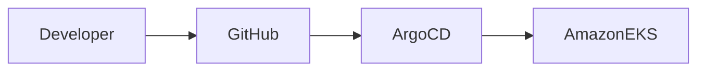
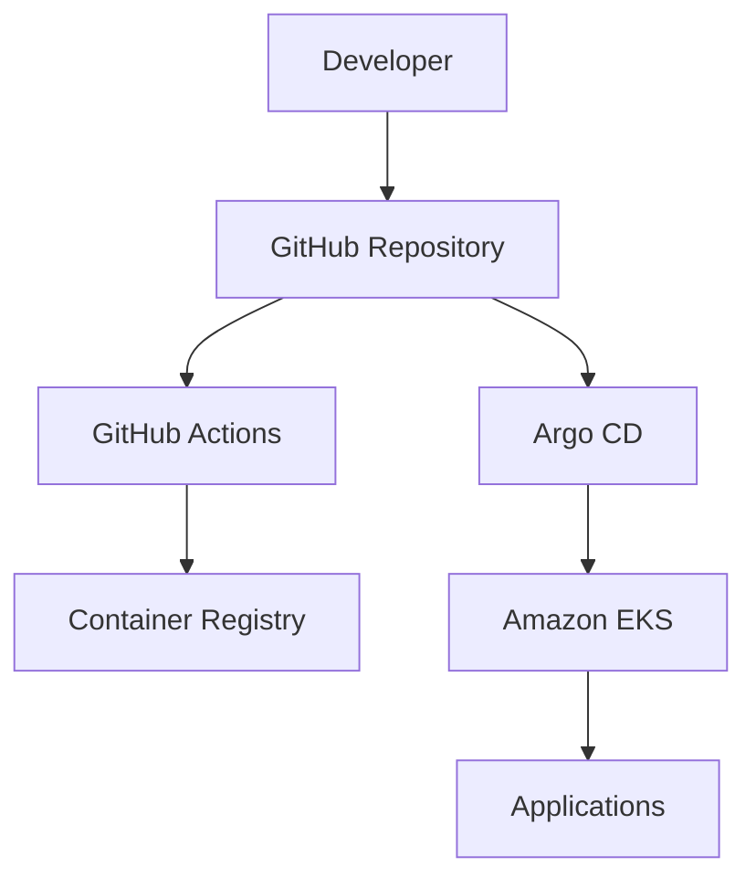
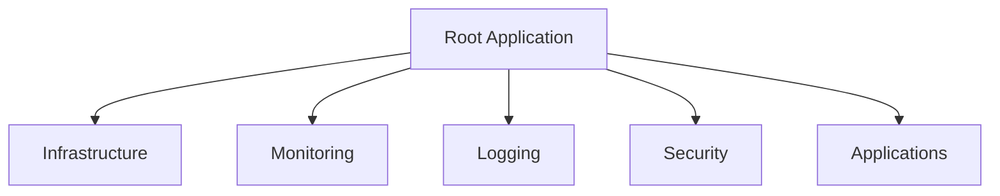
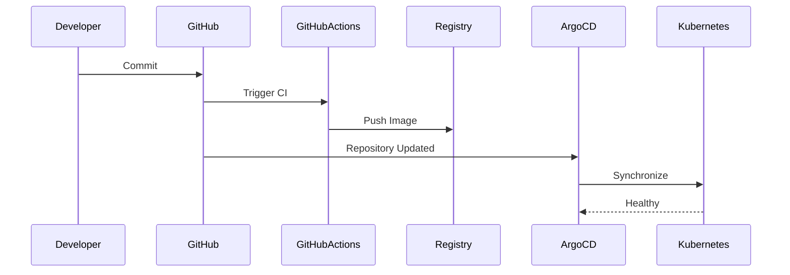
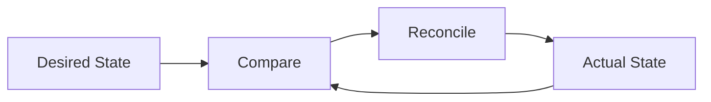
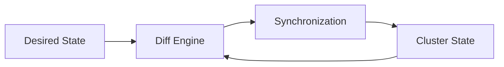
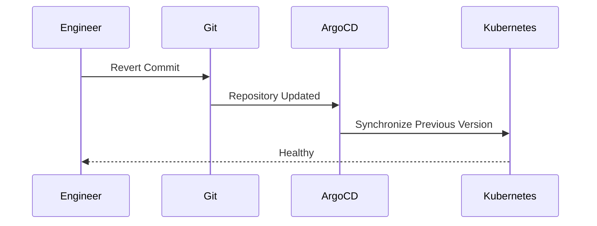
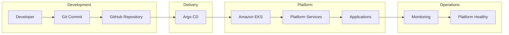

# GitOps Architecture

> This document describes the GitOps architecture implemented by the Valkyrie Platform, including repository organization, deployment workflows, reconciliation, synchronization, and operational practices.

---

# Table of Contents

1. Overview
2. GitOps Philosophy
3. Why GitOps?
4. Architecture
5. Repository Organization
6. App-of-Apps Pattern
7. Deployment Workflow
8. Reconciliation Model

---

# Overview

Valkyrie adopts a **GitOps-first** operational model where Git serves as the single source of truth for Kubernetes resources.

Rather than deploying workloads directly through CI/CD pipelines, Git repositories define the desired platform state. Argo CD continuously observes repository changes and reconciles the Kubernetes cluster to match the declared configuration.

This model provides:

- Declarative deployments
- Automated synchronization
- Drift detection
- Version-controlled infrastructure
- Simplified rollback
- Operational consistency

GitOps separates **continuous integration** from **continuous deployment**.

- GitHub Actions builds software.
- Argo CD deploys software.

---

# GitOps Philosophy

The GitOps implementation is guided by four principles.

## Declarative Configuration

Every Kubernetes resource is defined as code.

Examples include:

- Deployments
- Services
- Ingress
- ConfigMaps
- Namespaces
- Helm Releases

---

## Version Controlled

Every change passes through Git.

Benefits include:

- Code review
- Audit history
- Rollback
- Peer collaboration

---

## Automated Reconciliation

Argo CD continuously compares:

Desired State (Git)

↓

Actual State (Cluster)

When differences exist, reconciliation automatically restores the desired configuration.

---

## Continuous Observability

Every deployment has observable status.

Engineers can immediately determine:

- Sync status
- Health status
- Deployment history
- Failure conditions

---

# Why GitOps?

Traditional deployment pipelines push changes directly into Kubernetes.

```
Developer

↓

Pipeline

↓

kubectl apply
```

This approach often introduces:

- Configuration drift
- Manual fixes
- Poor visibility
- Difficult rollback

Valkyrie instead uses pull-based GitOps.



Advantages include:

| Capability | Benefit |
|------------|----------|
| Git History | Complete audit trail |
| Pull Model | Improved security |
| Drift Detection | Automatic correction |
| Rollback | Git revert |
| Observability | Continuous deployment visibility |

---

# High-Level Architecture



Deployment responsibility is intentionally divided.

| Component | Responsibility |
|-----------|----------------|
| GitHub | Source of truth |
| GitHub Actions | Build & publish |
| Container Registry | Store images |
| Argo CD | Deployment controller |
| Kubernetes | Runtime environment |

---

# Repository Organization

GitOps benefits from a predictable repository structure.

Example:

```text
argocd/

├── app-of-apps/
│   └── root.yaml
│
├── applications/
│   ├── prometheus.yaml
│   ├── grafana.yaml
│   ├── loki.yaml
│   ├── demo.yaml
│   └── trivy.yaml
│
├── projects/
│   └── platform-project.yaml
│
└── values/
```

> Replace this example with the actual directory structure from your repository.

---

# App-of-Apps Pattern

Valkyrie uses the App-of-Apps deployment pattern.

Rather than manually creating dozens of Argo CD Applications, a single root Application manages the complete platform.



Benefits include:

- Single bootstrap point
- Modular platform services
- Consistent deployments
- Simplified disaster recovery
- Easier onboarding

---

# Deployment Workflow

A typical deployment follows this lifecycle.



Deployment decisions are entirely driven by Git.

No manual deployment steps are required after GitOps bootstrap.

---

# Reconciliation Loop

Argo CD continuously evaluates cluster state.



Whenever the cluster diverges from Git, Argo CD attempts to restore the declared configuration automatically.

This reconciliation loop forms the foundation of the platform's operational model.

---
---

# Synchronization Policies

Argo CD supports multiple synchronization strategies depending on operational requirements.

Valkyrie is designed around **automated reconciliation**, allowing the platform to continuously converge toward the desired state defined in Git.

Typical synchronization options include:

| Policy | Description | Usage |
|----------|-------------|------|
| Manual | Engineer initiates deployment | Production change control |
| Automated | Argo CD deploys changes automatically | Development environments |
| Self Heal | Restores resources modified outside Git | Drift prevention |
| Prune | Removes obsolete Kubernetes resources | Repository consistency |

Example configuration:

```yaml
spec:
  syncPolicy:
    automated:
      prune: true
      selfHeal: true
```

---

# Continuous Reconciliation

One of GitOps' defining characteristics is continuous reconciliation.

Argo CD periodically compares:

- Desired State (Git)
- Live State (Kubernetes)

Whenever differences are detected, Argo CD restores the cluster to match Git.



This eliminates configuration drift caused by manual cluster modifications.

---

# Drift Detection

Configuration drift occurs when Kubernetes resources are modified outside the GitOps workflow.

Examples include:

- Manual `kubectl edit`
- Direct API changes
- Helm upgrades executed outside Git
- Accidental resource deletion

Without GitOps:

```
Git

≠

Cluster
```

With GitOps:

```
Git

=

Cluster
```

Argo CD continuously restores alignment.

---

# Sync Waves

Complex platforms require components to be deployed in a predictable order.

Sync Waves allow dependencies to be respected during deployment.

Example deployment order:

```text
Wave 0
Namespaces

↓

Wave 1
CRDs

↓

Wave 2
Platform Services

↓

Wave 3
Monitoring

↓

Wave 4
Security

↓

Wave 5
Applications
```

This ensures workloads are not deployed before their dependencies exist.

---

# Health Assessment

Argo CD evaluates application health independently from synchronization status.

An application can be:

| Sync Status | Health Status |
|-------------|---------------|
| Synced | Healthy |
| Synced | Progressing |
| Synced | Degraded |
| OutOfSync | Missing |
| OutOfSync | Unknown |

Synchronization confirms configuration.

Health confirms runtime behavior.

---

# Self-Healing

Self-healing is one of Valkyrie's key operational capabilities.

Example scenario:

```text
Engineer

↓

kubectl delete deployment frontend

↓

Deployment Removed

↓

Argo CD Detects Drift

↓

Deployment Recreated

↓

Platform Restored
```

The cluster automatically converges back to the desired state stored in Git.

---

# Rollback Strategy

Git becomes the deployment history.

Recovering from a failed deployment typically involves:

1. Identify the offending commit.
2. Revert the commit in Git.
3. Push the corrected history.
4. Argo CD detects the update.
5. Platform reconciles automatically.



This avoids manual rollback procedures and keeps recovery auditable.

---

# Deployment Visibility

Argo CD provides operational visibility into every deployment.

Typical information includes:

- Application health
- Synchronization status
- Deployment history
- Resource tree
- Live manifests
- Diff view
- Event history

This enables rapid troubleshooting without directly inspecting cluster resources.

---

# Multi-Environment Strategy

GitOps naturally supports multiple deployment environments.

Example layout:

```text
environments/

├── development/

├── staging/

└── production/
```

Each environment can reference:

- Different Helm values
- Different container tags
- Different replica counts
- Different resource limits

while sharing the same application definitions.

---

# Progressive Delivery

Although Valkyrie currently uses standard rolling deployments, GitOps enables more advanced deployment strategies.

Potential future enhancements include:

- Canary deployments
- Blue/Green deployments
- Progressive traffic shifting
- Automated rollback based on metrics

These capabilities can be introduced through tools such as Argo Rollouts.

---

# Operational Workflow

Daily platform operations follow a simple lifecycle.


Every infrastructure or application change follows the same operational model.

---

# Common GitOps Issues

| Issue | Possible Cause | Resolution |
|---------|----------------|------------|
| OutOfSync | Manual cluster changes | Synchronize application |
| Missing Resources | Repository inconsistency | Validate manifests |
| ImagePullBackOff | Missing image | Verify container registry |
| Degraded Application | Health probe failures | Inspect workload status |
| Failed Sync | Invalid manifest | Review Argo CD logs |

Useful troubleshooting commands:

```bash
kubectl get applications -n argocd

kubectl describe application <application>

kubectl logs deployment/argocd-application-controller -n argocd
```

---

# Operational Best Practices

The following practices help maintain a reliable GitOps workflow.

- Treat Git as the authoritative source.
- Avoid direct modifications to Kubernetes resources.
- Keep application manifests declarative.
- Review pull requests before merging.
- Enable automated reconciliation where appropriate.
- Use meaningful commit messages.
- Separate infrastructure from application configuration.
- Validate manifests before deployment.
- Monitor synchronization status regularly.

---

# Summary

GitOps forms the operational backbone of the Valkyrie Platform.

Terraform provisions the infrastructure.

Git stores the desired state.

GitHub Actions builds and publishes artifacts.

Argo CD continuously reconciles Kubernetes.

Together, these components provide a deployment workflow that is declarative, observable, auditable, and repeatable while minimizing manual operational effort.

---
