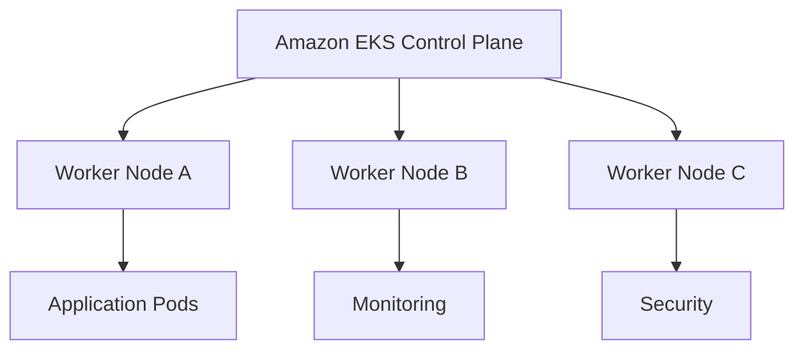
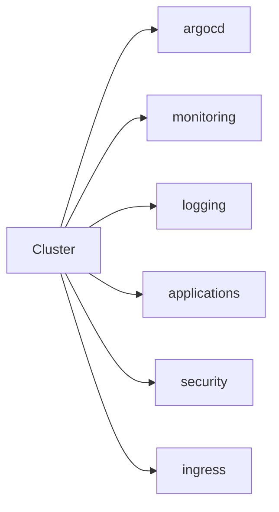
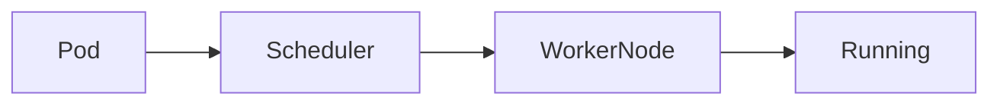
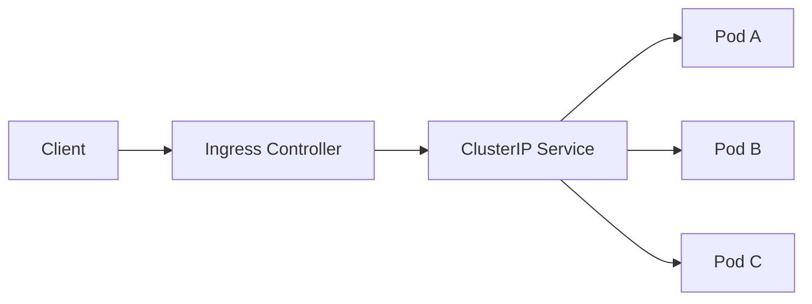
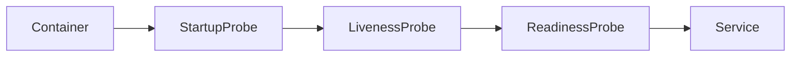
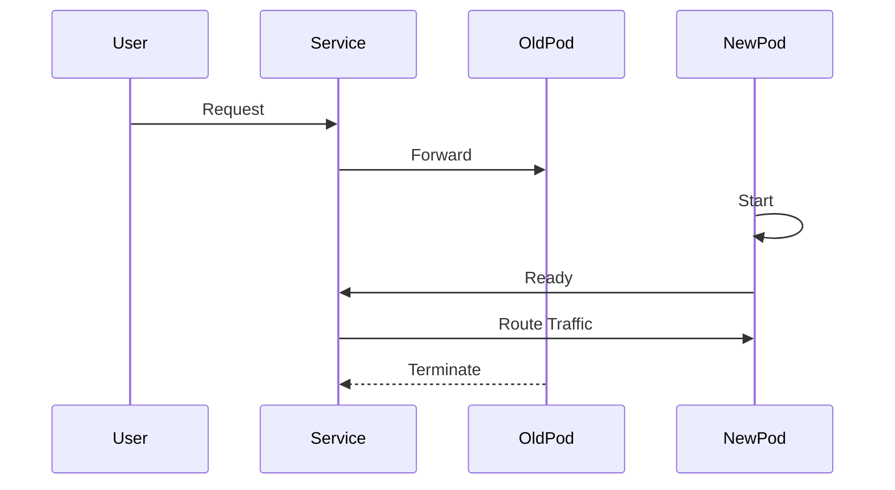
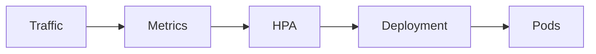
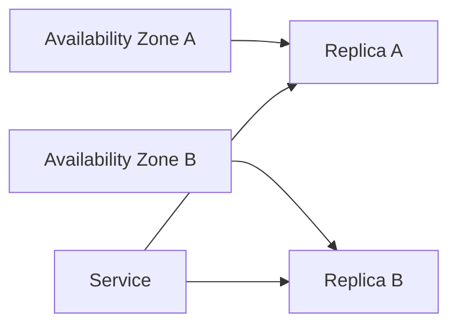

# Kubernetes Platform Architecture

> This document describes the Kubernetes architecture, workload organization, scheduling model, namespace strategy, and operational practices implemented within the Valkyrie Platform.

---

# Table of Contents

1. Overview
2. Platform Objectives
3. Cluster Architecture
4. Namespace Strategy
5. Resource Organization
6. Kubernetes Objects
7. Scheduling Model
8. Workload Design

---

# Overview

Amazon EKS provides the orchestration layer for the Valkyrie Platform.

Kubernetes is responsible for:

- Container scheduling
- Service discovery
- Self-healing
- Horizontal scaling
- Rolling deployments
- Configuration management
- Resource isolation

Infrastructure provisioning is performed through Terraform, while Kubernetes resources are continuously managed through Argo CD using a GitOps workflow.

---

# Platform Objectives

The Kubernetes platform is designed around the following engineering principles.

## Declarative Operations

Every Kubernetes resource is stored in Git.

No workload should be deployed manually using imperative commands.

Desired state is continuously reconciled by Argo CD.

---

## Namespace Isolation

Each platform capability is isolated into its own namespace.

This improves:

- Security
- RBAC
- Operational ownership
- Resource management
- Troubleshooting

---

## Self-Healing

Kubernetes automatically restores workloads after failures.

Examples include:

- Pod restart
- Replica recreation
- Node rescheduling
- Health probe recovery

---

## Scalability

Applications are designed to scale horizontally.

Platform components remain stateless wherever possible.

---

# Cluster Architecture



The Kubernetes control plane is managed by AWS.

Worker nodes execute platform workloads.

---

# Namespace Strategy

Namespaces represent logical boundaries inside the platform.

Typical namespace layout:

| Namespace | Responsibility |
|------------|----------------|
| argocd | GitOps Controller |
| monitoring | Prometheus, Grafana |
| logging | Loki |
| applications | Business workloads |
| security | Security tooling |
| ingress | Ingress Controller |

> Replace this table with the exact namespaces from your repository. If you do not have a separate `logging` namespace, document where Loki actually runs.

---

# Namespace Layout



Each namespace owns a specific operational responsibility.

---

# Kubernetes Resource Hierarchy

Applications are organized using native Kubernetes resources.

```text
Namespace
      │
Deployment
      │
ReplicaSet
      │
Pods
      │
Containers
```

Supporting resources include:

- Services
- ConfigMaps
- Secrets
- Ingress
- PersistentVolumeClaims
- ServiceAccounts

---

# Kubernetes Objects

## Deployment

Deployments manage the desired number of application replicas.

Responsibilities:

- Rolling updates
- Replica management
- Rollback support

---

## ReplicaSet

ReplicaSets maintain the required number of running Pods.

If a Pod fails, Kubernetes automatically creates a replacement.

---

## Pods

Pods are the smallest deployable unit.

Each Pod contains one or more tightly coupled containers.

Pods are intentionally treated as ephemeral.

---

## Services

Services provide stable networking for Pods.

Typical service types:

| Type | Purpose |
|------|---------|
| ClusterIP | Internal communication |
| NodePort | External testing |
| LoadBalancer | Internet-facing workloads |

---

## ConfigMaps

Configuration values that are not sensitive are stored in ConfigMaps.

Examples include:

- Application configuration
- Feature flags
- Environment variables

---

## Secrets

Sensitive configuration should be stored using Kubernetes Secrets.

Examples:

- Database passwords
- API tokens
- TLS certificates

Production deployments should integrate a dedicated secrets management solution (for example, AWS Secrets Manager or HashiCorp Vault) rather than relying solely on Kubernetes Secrets.

---

# Scheduling Model

Kubernetes schedules Pods according to available cluster resources.

Scheduling decisions consider:

- CPU
- Memory
- Node availability
- Affinity rules
- Taints and tolerations



---

# Workload Design

Platform workloads follow common Kubernetes design patterns.

Recommended characteristics:

- Stateless services where practical
- Multiple replicas for availability
- Readiness probes
- Liveness probes
- Resource requests
- Resource limits
- Rolling deployments

These practices improve reliability while reducing operational complexity.

---
---

# Service Networking

Kubernetes Services provide stable network identities for ephemeral Pods.

Rather than communicating directly with Pods, workloads communicate through Services, allowing Pods to be recreated without affecting consumers.



---

# Service Types

The platform uses different Service types depending on accessibility requirements.

| Service Type | Purpose | Typical Usage |
|--------------|----------|---------------|
| ClusterIP | Internal communication | Microservices |
| NodePort | Development and testing | Temporary access |
| LoadBalancer | Internet-facing workloads | Production ingress |

ClusterIP remains the default service type because internal communication should remain private unless explicitly exposed.

---

# Ingress Architecture

External traffic enters the cluster through an Ingress Controller.

The Ingress layer centralizes routing, TLS termination, and HTTP path management.

```mermaid
flowchart TD

Internet

-->

AWS Load Balancer

-->

Ingress Controller

-->

Frontend Service

Ingress Controller

-->

API Service

Frontend Service

-->

Frontend Pods

API Service

-->

Backend Pods
```

Responsibilities include:

- HTTP routing
- HTTPS termination
- Path-based routing
- Host-based routing
- Load balancing

---

# Resource Management

Every production workload should define resource requests and limits.

Example:

```yaml
resources:
  requests:
    cpu: "250m"
    memory: "256Mi"

  limits:
    cpu: "500m"
    memory: "512Mi"
```

Resource requests ensure the scheduler reserves sufficient capacity.

Resource limits prevent workloads from monopolizing cluster resources.

---

# Health Probes

Health probes allow Kubernetes to determine application state automatically.

Three probe types are commonly used.

| Probe | Purpose |
|---------|----------|
| Startup Probe | Determines application startup success |
| Liveness Probe | Detects unhealthy containers |
| Readiness Probe | Determines traffic eligibility |

---

## Probe Lifecycle



If a liveness probe fails repeatedly, Kubernetes automatically restarts the container.

If a readiness probe fails, the Pod remains running but is temporarily removed from Service endpoints.

---

# Rolling Updates

Deployments are updated without downtime.



This strategy enables continuous delivery while minimizing service disruption.

---

# Horizontal Scaling

Applications scale horizontally by increasing Pod replicas.

Horizontal Pod Autoscaler (HPA) can automatically adjust replica counts based on observed metrics.



Scaling decisions may use:

- CPU utilization
- Memory utilization
- Custom Prometheus metrics

---

# Scheduling Strategy

Kubernetes schedules Pods based on resource availability and scheduling constraints.

The platform may use:

- Node Selectors
- Node Affinity
- Pod Affinity
- Pod Anti-Affinity
- Taints
- Tolerations

These mechanisms improve workload placement and fault isolation.

---

# High Availability

Platform workloads should avoid single points of failure.

Recommended practices include:

- Multiple replicas
- Multi-AZ worker nodes
- Rolling updates
- Readiness probes
- Pod anti-affinity
- Pod Disruption Budgets

Example architecture:



---

# Pod Disruption Budgets

Pod Disruption Budgets (PDBs) protect critical workloads during voluntary disruptions such as node maintenance or upgrades.

Example:

```yaml
apiVersion: policy/v1
kind: PodDisruptionBudget

metadata:
  name: frontend-pdb

spec:
  minAvailable: 1

  selector:
    matchLabels:
      app: frontend
```

PDBs help ensure service availability during cluster operations.

---

# Configuration Management

Application configuration is externalized wherever possible.

| Resource | Purpose |
|-----------|----------|
| ConfigMap | Non-sensitive configuration |
| Secret | Sensitive values |
| Helm Values | Deployment customization |

Separating configuration from application code simplifies deployment across multiple environments.

---

# Operational Practices

The platform follows several operational guidelines.

- Treat Pods as ephemeral.
- Avoid manual changes to live workloads.
- Use GitOps for all Kubernetes resources.
- Monitor resource utilization continuously.
- Keep manifests declarative.
- Apply least-privilege RBAC.
- Validate changes in non-production environments first.

---

# Common Failure Scenarios

| Failure | Expected Kubernetes Behavior |
|-----------|------------------------------|
| Pod Crash | Restart container |
| Node Failure | Reschedule Pods |
| Deployment Failure | Rollout pause or rollback |
| Readiness Failure | Remove Pod from Service |
| Liveness Failure | Restart Pod |
| Replica Loss | Create replacement Pod |

Kubernetes continuously reconciles actual state with desired state, improving platform resilience.

---

# Debugging Workflows

Useful operational commands include:

```bash
# View Pods
kubectl get pods -A

# Describe a Pod
kubectl describe pod <pod-name>

# View logs
kubectl logs <pod-name>

# Stream logs
kubectl logs -f <pod-name>

# Execute into a container
kubectl exec -it <pod-name> -- /bin/sh

# Inspect events
kubectl get events --sort-by=.metadata.creationTimestamp
```

---

# Summary

Kubernetes serves as the operational foundation of the Valkyrie Platform.

By combining declarative resource management, GitOps, automated scheduling, self-healing, and standardized operational practices, the platform provides a consistent environment for deploying and operating cloud-native workloads.

Terraform provisions the infrastructure.

Git defines the desired state.

Argo CD reconciles the platform.

Kubernetes ensures workloads remain healthy and available.

---
