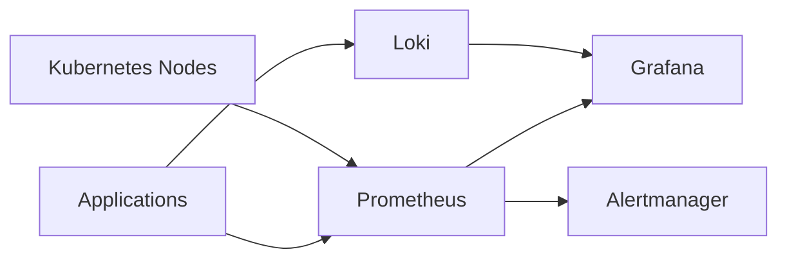
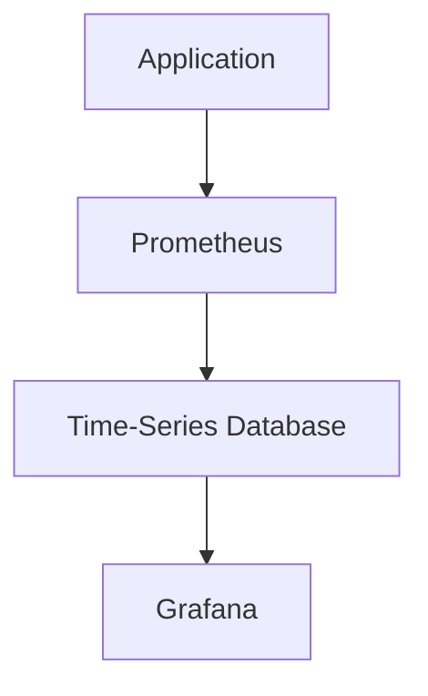
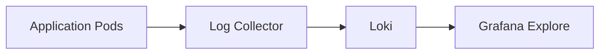
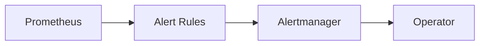
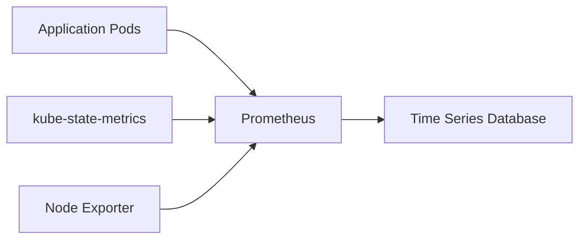
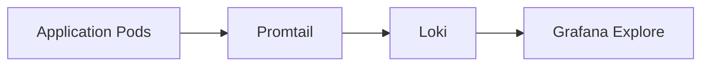
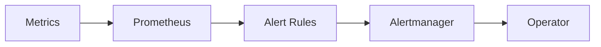
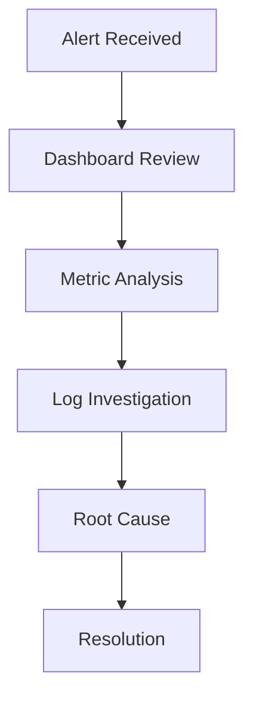
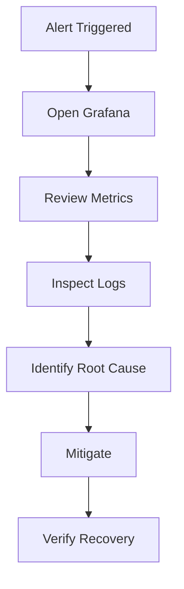

# Observability Architecture

> This document describes the observability architecture of the Valkyrie Platform, including metrics collection, visualization, logging, alerting, and operational telemetry.

---

# Table of Contents

1. Overview
2. Observability Philosophy
3. Architecture
4. Metrics Pipeline
5. Logging Pipeline
6. Alerting
7. Dashboard Strategy
8. Operational Principles

---

# Overview

Operating Kubernetes successfully requires continuous visibility into platform health.

The Valkyrie Platform integrates monitoring, logging, and alerting into a unified observability stack.

Core capabilities include:

- Infrastructure metrics
- Kubernetes metrics
- Application metrics
- Centralized logging
- Alerting
- Dashboard visualization

These components provide operators with sufficient context to detect, investigate, and respond to platform issues.

---

# Observability Philosophy

The platform follows several guiding principles.

## Telemetry by Default

Every platform component should expose telemetry.

Visibility should not be added after incidents occur.

---

## Single Operational View

Operators should not switch between multiple tools to understand system state.

Metrics, logs, and alerts should be accessible from a unified interface wherever possible.

---

## Actionable Alerts

Alerts should identify meaningful operational problems.

Avoid alerts that:

- Trigger frequently
- Lack remediation context
- Represent expected behavior

---

## Correlated Telemetry

Operational investigations should combine:

- Metrics
- Logs
- Deployment history

to reduce Mean Time To Resolution (MTTR).

---

# High-Level Architecture



---

# Metrics Pipeline

Prometheus continuously collects metrics from Kubernetes and platform workloads.

Typical scrape targets include:

| Target | Purpose |
|----------|----------|
| Kubernetes API | Cluster metrics |
| kube-state-metrics | Resource state |
| Node Exporter | Node metrics |
| Applications | Business metrics |

Metrics commonly include:

- CPU utilization
- Memory utilization
- Disk usage
- Network throughput
- Pod health
- Deployment status
- Node availability

---

# Metrics Collection Flow



Prometheus stores metrics as time-series data and Grafana visualizes the results.

---

# Logging Pipeline

Application and platform logs are centralized to simplify troubleshooting.



If Promtail is used as the log collector, replace **Log Collector** with **Promtail** to match the repository.

---

# Dashboard Strategy

Dashboards are organized by operational responsibility.

Typical dashboards include:

| Dashboard | Purpose |
|------------|----------|
| Kubernetes Cluster | Overall cluster health |
| Node Metrics | Infrastructure utilization |
| Workload Metrics | Application performance |
| Namespace Metrics | Resource allocation |
| Platform Overview | High-level operational status |

Dashboards should answer operational questions rather than simply display large numbers of graphs.

---

# Alerting

Prometheus evaluates alert rules continuously.

Alertmanager routes triggered alerts to configured notification channels.



Alert rules should focus on operational impact rather than transient events.

---

# Operational Principles

The observability stack supports the following goals:

- Detect failures quickly
- Provide sufficient diagnostic context
- Minimize alert fatigue
- Support proactive capacity planning
- Improve operational visibility

Observability is treated as a core platform capability rather than an optional add-on.

---
---

# Prometheus Architecture

Prometheus serves as the primary metrics collection engine for the Valkyrie Platform.

It continuously scrapes metrics from Kubernetes components and platform workloads at configurable intervals.



Prometheus stores all collected metrics locally as time-series data and evaluates alerting rules continuously.

---

# Metrics Collection Strategy

Metrics are collected from multiple layers of the platform.

| Layer | Metrics |
|--------|---------|
| Kubernetes | Pod status, Deployments, ReplicaSets |
| Worker Nodes | CPU, Memory, Disk, Network |
| Applications | Request rate, Response latency, Errors |
| Infrastructure | Node availability, Resource utilization |

Metrics are collected automatically without requiring application-specific changes whenever exporters expose Prometheus-compatible endpoints.

---

# Grafana Dashboards

Grafana provides visualization for platform telemetry.

Dashboards should answer operational questions rather than display every available metric.

Recommended dashboard categories:

| Dashboard | Purpose |
|------------|----------|
| Platform Overview | Overall cluster health |
| Kubernetes | Deployments, Pods, Namespaces |
| Nodes | Infrastructure utilization |
| Applications | Service health and performance |
| Networking | Traffic and latency |
| Capacity | Resource consumption trends |

---

# Dashboard Design Principles

Effective dashboards should:

- Highlight operational health.
- Surface abnormal behavior quickly.
- Minimize unnecessary visual noise.
- Support rapid incident investigation.

A typical dashboard begins with high-level health indicators before exposing lower-level diagnostic metrics.

---

# Logging Architecture

Centralized logging complements metrics by providing detailed operational context.



Promtail collects container logs and forwards them to Loki.

Grafana Explore provides a unified interface for searching and correlating logs.

> Replace Promtail with the actual log collector if your implementation differs.

---

# Log Query Examples

Operators commonly investigate:

- Application errors
- CrashLoopBackOff events
- Authentication failures
- Startup failures
- Unexpected restarts

Example LogQL query:

```logql
{namespace="applications"} |= "ERROR"
```

Another example:

```logql
{app="frontend"} |= "exception"
```

Document queries that are relevant to your own applications rather than generic examples.

---

# Alerting Strategy

Alerting should focus on operational impact rather than infrastructure noise.

Examples of meaningful alerts include:

| Alert | Trigger |
|--------|----------|
| High CPU Usage | Sustained CPU above threshold |
| Memory Pressure | High memory consumption |
| Pod CrashLoopBackOff | Repeated container failures |
| Node Not Ready | Worker node unavailable |
| Deployment Failure | Replica count mismatch |

Alerts should be actionable and include sufficient context for investigation.

---

# Alert Lifecycle



Alertmanager groups related alerts and routes notifications according to configured policies.

---

# Metrics, Logs, and Alerts Together

Operational investigations typically follow this workflow.



Combining metrics with logs significantly reduces Mean Time To Resolution (MTTR).

---

# Capacity Planning

Historical metrics support infrastructure planning.

Examples include:

- CPU growth
- Memory consumption
- Storage utilization
- Pod density
- Namespace growth

Trend analysis helps operators identify scaling requirements before resource exhaustion occurs.

---

# SLI / SLO Considerations

Modern SRE practices define measurable service objectives.

Common Service Level Indicators (SLIs):

| Indicator | Description |
|------------|-------------|
| Availability | Successful request percentage |
| Latency | Response time |
| Error Rate | Failed request percentage |
| Throughput | Requests per second |

If SLOs are not currently implemented in Valkyrie, this section should describe recommended future practices rather than imply active enforcement.

---

# Incident Investigation Workflow

During an incident, operators typically follow this sequence.



This workflow provides a repeatable process for diagnosing production issues.

---

# Operational Best Practices

Recommended practices include:

- Define alerts based on user impact.
- Avoid duplicate alert rules.
- Regularly review dashboard usefulness.
- Retain metrics according to operational needs.
- Correlate metrics with logs during investigations.
- Remove unused dashboards and obsolete alerts.
- Keep observability configuration under version control.

---

# Summary

Observability provides the operational visibility required to manage Kubernetes workloads effectively.

Within Valkyrie:

- **Prometheus** collects metrics.
- **Grafana** visualizes platform health.
- **Loki** centralizes logs.
- **Alertmanager** routes notifications.

Together, these components provide the telemetry needed to detect failures, investigate incidents, and operate the platform reliably.

---
