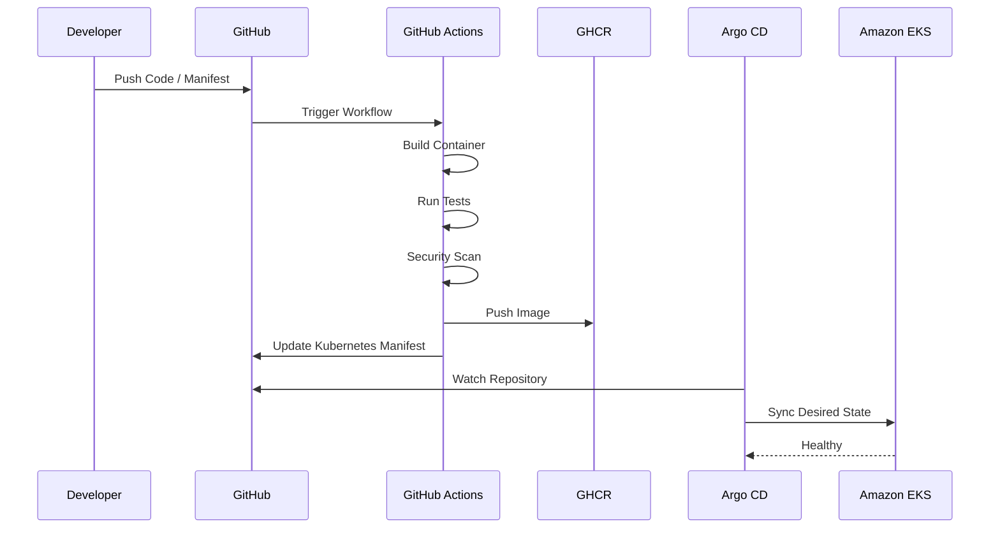
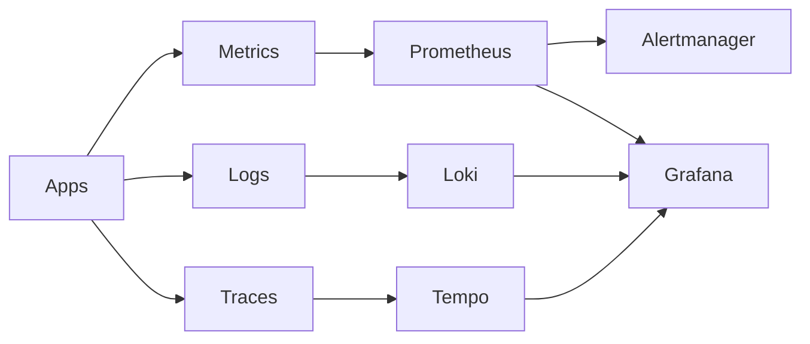
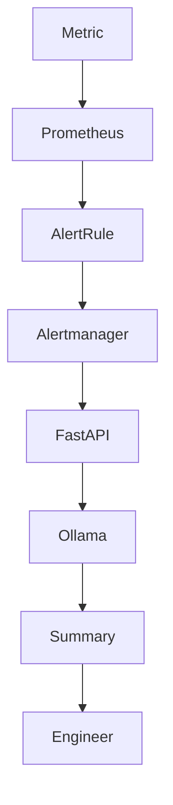
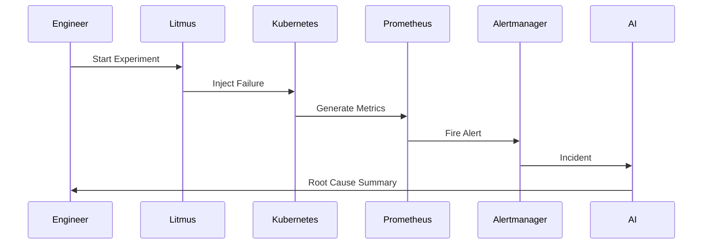
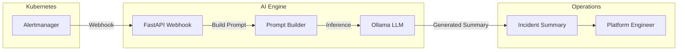

<div align="center">

# 🛡️ Valkyrie Platform

### Production-Grade Platform Engineering on AWS

**Cloud Native • Kubernetes • GitOps • Observability • Security • Chaos Engineering • AI Incident Response**

---

[](https://kubernetes.io)
[](https://terraform.io)
[](https://aws.amazon.com)
[](https://argo-cd.readthedocs.io)
[](https://prometheus.io)
[](https://grafana.com)
[](LICENSE)

---

*A production-style cloud platform demonstrating modern Platform Engineering practices through Infrastructure as Code, GitOps, Kubernetes, Observability, Security, Chaos Engineering, and AI-assisted Incident Response.*

</div>

---

# Table of Contents

- [Overview](#overview)
- [Why Valkyrie?](#why-valkyrie)
- [Problem Statement](#problem-statement)
- [Project Goals](#project-goals)
- [Production Characteristics](#production-characteristics)
- [Architecture Overview](#architecture-overview)
- [Platform Capabilities](#platform-capabilities)
- [Documentation](#documentation)

---

# Overview

Valkyrie Platform is a **production-style Platform Engineering project** built on **Amazon EKS** that demonstrates how modern cloud-native infrastructure can be provisioned, deployed, secured, monitored, and operated using declarative workflows.

Rather than showcasing individual tools in isolation, Valkyrie combines infrastructure provisioning, GitOps, observability, security, chaos engineering, and AI-assisted operations into a cohesive platform that resembles the architecture and operational model used by engineering organizations running Kubernetes at scale.

The platform emphasizes:

- Infrastructure as Code
- GitOps-first continuous delivery
- Production observability
- Security by default
- Operational resilience
- Autonomous incident response
- Developer self-service

---

# Why Valkyrie?

Modern Kubernetes environments often evolve into disconnected collections of tools.

Infrastructure is provisioned separately.

Applications are deployed differently.

Monitoring is configured later.

Security becomes an afterthought.

Operational knowledge lives only in engineers' heads.

Valkyrie was created to demonstrate how these concerns can be integrated into a single engineering platform where every layer—from infrastructure provisioning to incident response—is declarative, observable, reproducible, and automated.

The project focuses on **engineering systems**, not simply deploying applications.

---

# Problem Statement

Operating Kubernetes in production requires much more than creating a cluster.

Engineering teams must solve problems such as:

- Infrastructure provisioning
- Continuous delivery
- Cluster observability
- Runtime security
- Policy enforcement
- Secrets management
- Incident response
- Disaster recovery
- Platform reliability
- Developer experience

These responsibilities are frequently implemented as independent solutions, increasing operational complexity.

Valkyrie demonstrates an opinionated reference implementation where these capabilities work together as a unified platform.

---

# Project Goals

The project was designed around several engineering objectives.

## Infrastructure

- Declarative AWS infrastructure provisioning
- Repeatable environments
- Version-controlled infrastructure
- Automated cluster lifecycle

---

## Delivery

- GitOps-first deployment model
- Automated synchronization
- Declarative application management
- Zero manual Kubernetes changes

---

## Reliability

- Platform observability
- Metrics
- Logs
- Distributed tracing
- Alerting
- Dashboarding

---

## Security

- Continuous vulnerability scanning
- Runtime threat detection
- Admission control
- Policy enforcement
- Least-privilege access

---

## Resilience

- Fault injection
- Chaos experiments
- Recovery validation
- Alert verification

---

## AI Operations

- Local LLM-powered incident summarization
- Privacy-preserving inference
- Automatic alert interpretation
- Human-readable root-cause summaries

---

# Production Characteristics

Valkyrie is intentionally designed to resemble the operational characteristics of production Kubernetes platforms.

| Capability | Implementation |
|------------|----------------|
| Cloud Platform | AWS |
| Kubernetes Distribution | Amazon EKS |
| Infrastructure Provisioning | Terraform |
| Container Orchestration | Kubernetes |
| Package Management | Helm |
| Continuous Delivery | Argo CD |
| GitOps | App of Apps |
| Container Registry | GitHub Container Registry |
| Monitoring | Prometheus |
| Visualization | Grafana |
| Logging | Loki |
| Tracing | Tempo |
| Alerting | Alertmanager |
| Security | Trivy + Falco + Kyverno |
| Chaos Engineering | LitmusChaos |
| AI Operations | Ollama + FastAPI |
| Developer Portal | Backstage |

---

# Architecture Overview

At a high level, Valkyrie consists of five major platform layers.

```text
                    Developer

                        │
                        ▼

                GitHub Repository

                        │

                GitHub Actions CI

                        │

               GitOps (Argo CD)

                        │

             Amazon EKS Platform

        ┌─────────────┬─────────────┬─────────────┐

   Applications   Observability   Security

        │             │             │

        └─────────────┴─────────────┘

              Chaos Engineering

                        │

               AI Incident Engine
```

A detailed architecture explanation, component interactions, and sequence diagrams are available in **ARCHITECTURE.md**.

---

# Platform Capabilities

Valkyrie integrates multiple engineering domains into a single platform.

| Domain | Capability |
|---------|------------|
| Platform Engineering | Kubernetes platform lifecycle |
| Cloud Infrastructure | AWS provisioning with Terraform |
| GitOps | Declarative continuous delivery |
| CI/CD | GitHub Actions pipelines |
| Monitoring | Metrics, logs, traces |
| Security | Runtime protection and policy enforcement |
| Reliability | Alerting and incident response |
| Chaos Engineering | Failure simulation |
| AI Operations | Automated incident summarization |
| Developer Experience | Backstage service catalog |

---

# Documentation

Comprehensive documentation is available for every platform component.

| Document | Description |
|----------|-------------|
| ARCHITECTURE.md | Overall platform architecture |
| DEPLOYMENT.md | Installation and deployment guide |
| TERRAFORM.md | Infrastructure provisioning |
| KUBERNETES.md | Cluster architecture |
| GITOPS.md | GitOps implementation |
| OBSERVABILITY.md | Monitoring and logging |
| SECURITY.md | Platform security model |
| CHAOS-ENGINEERING.md | Chaos experiments |
| AI-INCIDENT-ENGINE.md | AI incident response pipeline |
| TROUBLESHOOTING.md | Operational runbooks |
| ROADMAP.md | Future enhancements |

---

> **Valkyrie is not intended to be a Kubernetes distribution or production framework.**
>
> It is a production-style reference platform that demonstrates how modern Platform Engineering principles can be combined into a cohesive cloud-native operating model.

---

# Repository Structure

The repository follows a layered architecture where each directory represents a distinct responsibility within the platform.

```text
valkyrie-platform/
│
├── infrastructure/
│   ├── terraform/
│   └── modules/
│
├── kubernetes/
│   ├── base/
│   ├── overlays/
│   ├── applications/
│   └── namespaces/
│
├── argocd/
│   ├── app-of-apps/
│   ├── applications/
│   └── projects/
│
├── monitoring/
│   ├── prometheus/
│   ├── grafana/
│   ├── loki/
│   ├── tempo/
│   └── alertmanager/
│
├── security/
│   ├── trivy/
│   ├── falco/
│   ├── kyverno/
│   └── policies/
│
├── chaos/
│   ├── litmus/
│   └── experiments/
│
├── ai/
│   ├── fastapi/
│   ├── prompts/
│   └── ollama/
│
├── backstage/
│
├── scripts/
│
├── docs/
│
└── assets/
```

The separation of responsibilities allows each platform capability to evolve independently while remaining declaratively managed through GitOps.

---

# Engineering Principles

Valkyrie was designed around a small number of engineering principles that guided every architectural decision.

## Infrastructure is Immutable

Infrastructure is never created manually.

Every cloud resource originates from Terraform.

This guarantees:

- Version control
- Repeatability
- Peer review
- Disaster recovery
- Environment consistency

---

## Git is the Source of Truth

Every platform configuration is stored in Git.

No Kubernetes objects are modified manually.

Argo CD continuously reconciles cluster state against Git, eliminating configuration drift.

---

## Everything is Observable

Every service should expose telemetry.

Every platform component should produce metrics.

Every workload should generate logs.

Every request should be traceable.

Operational visibility is treated as a platform requirement rather than an optional feature.

---

## Security by Default

Security controls are embedded directly into the platform.

Instead of relying on manual reviews, Valkyrie continuously enforces security through:

- Admission policies
- Runtime detection
- Image scanning
- Least-privilege access

---

## Operational Simplicity

Operational complexity should be automated wherever possible.

Examples include:

- Automatic deployments
- Automatic synchronization
- Automatic alert routing
- Automatic incident summarization

The objective is reducing operational overhead rather than increasing operational tooling.

---

# Technology Decisions

One of the goals of Valkyrie is demonstrating engineering trade-offs.

This section explains **why** particular technologies were selected.

---

## Why Amazon EKS?

Amazon EKS provides a managed Kubernetes control plane while allowing complete control over worker nodes, networking, IAM integration, and cluster add-ons.

It provides an environment representative of production Kubernetes deployments commonly used by enterprise organizations.

---

## Why Terraform?

Infrastructure provisioning should be:

- Declarative
- Version controlled
- Repeatable
- Reviewable

Terraform enables infrastructure to be treated as software while supporting reusable modules and cloud portability.

---

## Why GitHub Actions?

GitHub Actions integrates naturally with GitHub repositories and enables infrastructure validation, container builds, security scanning, and artifact publishing through automated workflows.

It also removes the need for maintaining dedicated CI infrastructure.

---

## Why Argo CD?

Traditional CI/CD systems push deployments into Kubernetes.

Valkyrie adopts a GitOps workflow where Kubernetes continuously pulls desired state from Git.

Advantages include:

- Automatic drift detection
- Rollback through Git history
- Declarative deployments
- Improved auditability
- Reduced operational risk

---

## Why Helm?

Applications often contain many Kubernetes resources.

Helm provides:

- Reusable packaging
- Parameterized deployments
- Versioned releases
- Simplified upgrades

without duplicating Kubernetes manifests.

---

## Why Prometheus?

Prometheus has become the de facto monitoring solution for Kubernetes.

Its pull-based architecture, service discovery, and PromQL query language make it well suited for cloud-native environments.

---

## Why Grafana?

Grafana provides a unified visualization layer capable of combining metrics, logs, traces, and alert information into operational dashboards.

This reduces context switching during production incidents.

---

## Why Loki?

Traditional log aggregation platforms can become operationally expensive.

Loki indexes labels rather than log contents, providing efficient log aggregation while integrating tightly with Grafana.

---

## Why Tempo?

Distributed tracing enables engineers to understand request lifecycles across multiple services.

Tempo complements Prometheus and Loki by providing trace correlation without requiring expensive indexing.

---

## Why Falco?

Preventing attacks is only part of security.

Production systems must also detect suspicious runtime behavior.

Falco monitors Linux system calls using eBPF and generates alerts when workloads exhibit unexpected activity.

---

## Why Kyverno?

Security policies should be enforced automatically.

Kyverno allows Kubernetes admission policies to be written as native Kubernetes resources rather than external policy languages.

---

## Why LitmusChaos?

Reliability cannot be assumed.

Chaos Engineering validates that monitoring, alerting, and recovery procedures function correctly during failure scenarios.

---

## Why Ollama?

Many AI-assisted operations platforms rely on external APIs.

Valkyrie intentionally uses Ollama to demonstrate a privacy-preserving approach where incident summaries are generated locally without sending production telemetry to third-party services.

---

# Platform Workflow

The platform lifecycle follows a fully declarative workflow.

```text
Developer
      │
      ▼

Git Commit
      │
      ▼

GitHub Repository
      │
      ▼

GitHub Actions
      │
      ▼

Container Registry
      │
      ▼

Argo CD
      │
      ▼

Amazon EKS
      │
      ▼

Applications
      │
      ▼

Monitoring
      │
      ▼

Alertmanager
      │
      ▼

AI Incident Engine
```

Each stage is independently observable while remaining part of a unified deployment pipeline.

---

# Deployment Model

Valkyrie separates responsibilities across multiple deployment layers.

| Layer | Responsibility |
|---------|----------------|
| Infrastructure | AWS resources provisioned through Terraform |
| Platform Services | Argo CD, Prometheus, Grafana, Loki, Tempo |
| Security | Trivy, Falco, Kyverno |
| Workloads | Applications deployed through GitOps |
| AI Operations | Incident summarization |
| Developer Portal | Backstage |

This layered deployment model allows individual platform components to evolve independently while maintaining a consistent operational model.

---

---

# GitOps Delivery Workflow

Valkyrie adopts a **GitOps-first** deployment model where Git serves as the single source of truth.

Every infrastructure or application change follows the same declarative workflow.



---

## Why GitOps?

Traditional deployment pipelines **push** changes into Kubernetes.

GitOps platforms continuously **pull** desired state from Git.

Benefits include:

- Declarative deployments
- Automatic reconciliation
- Configuration drift detection
- Git-based rollback
- Improved auditability
- Reduced operational complexity

---

# Kubernetes Architecture

The platform separates workloads into logical namespaces.

```text
Amazon EKS

├── argocd
│
├── observability
│
├── security
│
├── demo
│
├── ai
│
├── backstage
│
└── litmus
```

Each namespace represents an independent operational concern.

This separation improves:

- Isolation
- RBAC
- Resource management
- Operational ownership

---

# Namespace Responsibilities

| Namespace | Purpose |
|------------|---------|
| argocd | GitOps controller |
| observability | Metrics, dashboards, logs, traces |
| security | Runtime security & policies |
| demo | Sample applications |
| ai | Incident summarization |
| backstage | Developer portal |
| litmus | Chaos experiments |

---

# Observability Architecture

Modern production platforms require visibility into every layer.

Valkyrie combines metrics, logs, traces, and alerts into a unified operational workflow.



---

## Observability Components

### Metrics

Prometheus continuously scrapes metrics from Kubernetes workloads.

Collected metrics include:

- CPU
- Memory
- Network
- Pod Status
- Node Health
- Application Metrics

---

### Logs

Promtail forwards container logs into Loki.

Logs are indexed by labels, enabling efficient querying while minimizing storage overhead.

---

### Traces

Tempo stores distributed traces generated by instrumented applications.

Tracing provides request-level visibility across multiple services.

---

### Dashboards

Grafana aggregates:

- Metrics
- Logs
- Traces
- Alerts

into a unified operational interface.

---

# Alert Lifecycle



Instead of delivering raw alerts, Valkyrie enriches incidents with AI-generated summaries.

---

# Security Architecture

Security controls are implemented across multiple layers.

```text
Container Image

↓

Trivy Scan

↓

GitOps Deployment

↓

Kyverno Admission

↓

Running Pod

↓

Falco Runtime Monitoring

↓

Alertmanager

↓

AI Incident Engine
```

---

## Security Layers

### Image Security

- Trivy Operator
- CVE detection
- Dependency scanning

---

### Admission Control

Kyverno validates:

- Security Context
- Resource Limits
- Required Labels
- Best Practices

before workloads enter the cluster.

---

### Runtime Detection

Falco monitors:

- Suspicious Processes
- Privilege Escalation
- Sensitive File Access
- Network Activity

using eBPF.

---

# Chaos Engineering

Reliability cannot be assumed.

Every production platform should validate its recovery mechanisms.

Valkyrie integrates LitmusChaos for controlled fault injection.

Supported experiments include:

- Pod deletion
- CPU stress
- Memory stress
- Network latency
- Node failure simulation

---

## Chaos Workflow



---

# AI Incident Engine

The AI subsystem is intentionally designed to remain local.

No production telemetry leaves the cluster.

Workflow:

1. Alertmanager sends webhook.
2. FastAPI receives incident.
3. Context is collected.
4. Prompt is generated.
5. Ollama executes inference.
6. Human-readable summary returned.



---

## Why Local AI?

Most AIOps platforms depend on cloud-hosted LLMs.

Valkyrie instead demonstrates:

- Privacy preservation
- Reduced latency
- Offline capability
- Zero external telemetry exposure

making it suitable for regulated environments.

---

---

# Performance Characteristics

The platform was designed with operational efficiency and reproducibility in mind.

| Characteristic | Result |
|----------------|--------|
| Infrastructure Provisioning | 80–85% faster using Terraform |
| Deployment Time | Reduced from ~20 minutes to under 5 minutes |
| Delivery Model | Fully declarative GitOps |
| Platform Availability | Designed around highly available Kubernetes workloads |
| Deployment Consistency | Eliminated manual cluster deployments |
| Security | Automated image scanning, runtime monitoring, and policy enforcement |
| Observability | Unified metrics, logs, traces, and dashboards |

> These measurements are representative of the reference environment used during development and validation.

---

# Screenshots

The following screenshots demonstrate the platform in operation.

## GitOps

- Argo CD Dashboard
- Application Health
- Sync Status

```
assets/screenshots/argocd-dashboard.png
```

---

## Monitoring

- Grafana Platform Overview
- Kubernetes Cluster Dashboard
- Node Metrics
- Application Metrics

```
assets/screenshots/grafana-overview.png
```

---

## Logging

- Loki Log Explorer
- Application Logs
- Query Examples

```
assets/screenshots/loki-logs.png
```

---

## Security

- Trivy Vulnerability Reports
- Falco Runtime Alerts
- Kyverno Policies

```
assets/screenshots/security-dashboard.png
```

---

## AI Incident Engine

- Alertmanager Notification
- FastAPI Webhook
- Ollama Summary
- Incident Response Output

```
assets/screenshots/ai-summary.png
```

---

# Repository Metrics

| Metric | Value |
|----------|-------|
| Infrastructure Modules | Terraform |
| Kubernetes Namespaces | 8+ |
| Platform Components | 15+ |
| Technologies Integrated | 20+ |
| GitOps Applications | Multiple |
| Observability Components | 6+ |
| Security Components | 4+ |

---

# Design Trade-offs

Engineering is fundamentally about making informed trade-offs.

The following decisions were made intentionally.

## Local AI vs Cloud AI

Chosen:

- Local inference using Ollama

Advantages:

- Privacy
- Offline operation
- No external telemetry

Trade-off:

- Larger local resource requirements.

---

## GitOps vs Push-Based Deployments

Chosen:

- Pull-based GitOps with Argo CD.

Advantages:

- Drift detection
- Auditability
- Declarative delivery

Trade-off:

- Slightly slower reconciliation compared to direct pushes.

---

## Loki vs Elasticsearch

Chosen:

- Loki

Advantages:

- Lower operational complexity
- Better Grafana integration
- Lower storage overhead

Trade-off:

- Less sophisticated full-text indexing.

---

# Lessons Learned

Building Valkyrie highlighted several practical engineering lessons.

## Infrastructure

- Remote Terraform state management simplifies collaboration.
- Modular Terraform significantly improves maintainability.

---

## Kubernetes

- Namespace isolation improves operational ownership.
- RBAC should be designed early rather than added later.

---

## GitOps

- Git becomes the operational history of the platform.
- Declarative deployments reduce configuration drift.

---

## Monitoring

- Dashboards should answer operational questions rather than display every metric.
- Alert fatigue is often caused by poor threshold design rather than insufficient monitoring.

---

## Security

- Runtime detection complements vulnerability scanning.
- Policy enforcement prevents operational mistakes before deployment.

---

## AI Operations

- Context is more valuable than raw alerts.
- Small local language models are sufficient for operational summarization.

---

# Known Limitations

This repository is intended as a **production-style reference implementation**.

Current limitations include:

- Single-region deployment
- No multi-cluster federation
- Manual certificate rotation
- Basic backup strategy
- No Cluster Autoscaler
- No Karpenter integration
- No Service Mesh
- Disaster recovery procedures are not fully automated

These areas are intentionally left open for future enhancement.

---

# Roadmap

## Platform

- [x] Infrastructure as Code
- [x] GitOps
- [x] Observability
- [x] Security
- [x] Chaos Engineering
- [x] AI Incident Engine
- [x] Developer Portal

---

## Planned Improvements

### Kubernetes

- [ ] Karpenter
- [ ] Cluster Autoscaler
- [ ] Gateway API
- [ ] Multi-cluster Support

---

### Security

- [ ] Cosign Image Signing
- [ ] SBOM Generation
- [ ] OPA Integration

---

### Platform Engineering

- [ ] Crossplane
- [ ] Internal Developer Platform
- [ ] Self-Service Infrastructure

---

### Observability

- [ ] OpenTelemetry Collector
- [ ] SLO Dashboard
- [ ] Error Budget Reporting

---

### Reliability

- [ ] Multi-region Failover
- [ ] Disaster Recovery Automation
- [ ] Backup Validation

---

# Documentation

| Document | Description |
|----------|-------------|
| ARCHITECTURE.md | Platform architecture |
| DEPLOYMENT.md | Deployment guide |
| TERRAFORM.md | Infrastructure provisioning |
| KUBERNETES.md | Cluster architecture |
| GITOPS.md | GitOps implementation |
| OBSERVABILITY.md | Monitoring, logging, tracing |
| SECURITY.md | Security architecture |
| CHAOS-ENGINEERING.md | Failure testing |
| AI-INCIDENT-ENGINE.md | AI Operations |
| TROUBLESHOOTING.md | Operational runbooks |
| ROADMAP.md | Future improvements |

---

# Contributing

Contributions, suggestions, and discussions are welcome.

If you discover a bug or have an idea for improving the platform:

1. Open an issue.
2. Describe the proposed enhancement.
3. Submit a pull request.
4. Ensure documentation remains consistent with implementation.

See **CONTRIBUTING.md** for additional details.

---

# License

This repository is licensed under the MIT License.

See the [LICENSE](LICENSE) file for complete licensing information.

---

# Acknowledgements

Valkyrie draws inspiration from the cloud-native ecosystem and the engineering practices promoted by:

- Kubernetes
- CNCF
- Argo CD
- Grafana Labs
- Prometheus
- HashiCorp
- OpenTelemetry
- Backstage
- AWS

The project is intended as a learning and reference platform that demonstrates how these technologies can be combined into a cohesive, production-style engineering environment.

---

<div align="center">

### Valkyrie Platform

*A production-style Platform Engineering reference implementation demonstrating Infrastructure as Code, GitOps, Kubernetes, Observability, Security, Chaos Engineering, and AI-assisted Operations.*

Built by **Kunal Waghmare**

</div>
