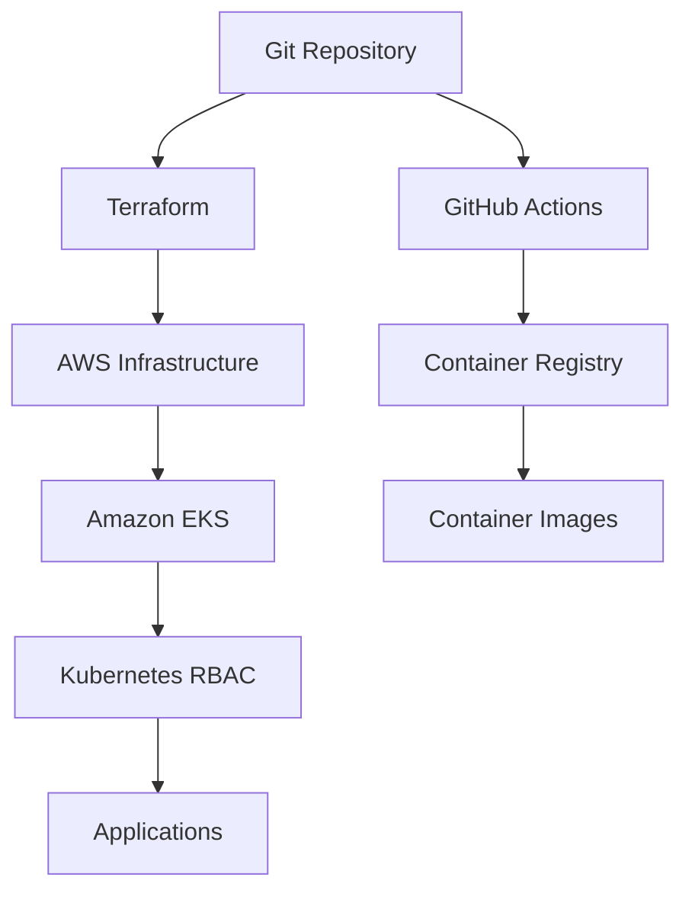
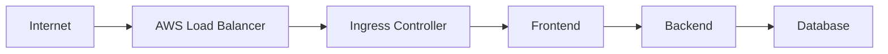
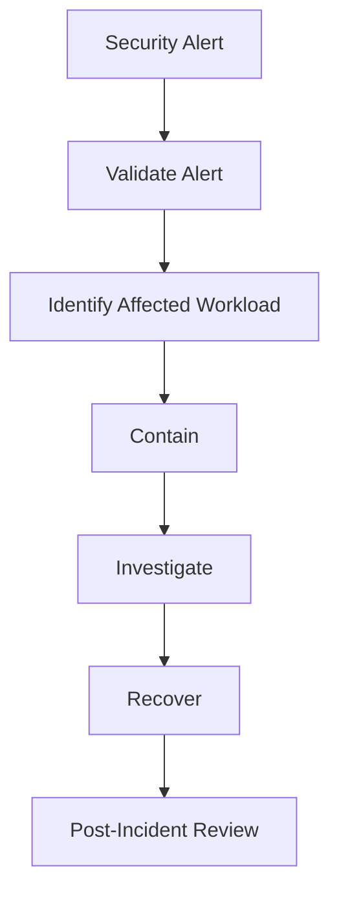

# Security Architecture

> This document describes the security architecture of the Valkyrie Platform, including cloud security, Kubernetes security, workload isolation, vulnerability management, and operational security practices.

---

# Table of Contents

1. Overview
2. Security Principles
3. Defense-in-Depth
4. Identity & Access Management
5. Kubernetes Security
6. Container Security
7. Secret Management
8. Platform Security Layers

---

# Overview

Security is integrated throughout the Valkyrie Platform rather than implemented as a separate operational concern.

The platform follows a layered security model designed to reduce attack surface, enforce least privilege, and continuously validate workloads throughout their lifecycle.

Security controls span multiple layers including:

- AWS Identity and Access Management (IAM)
- Kubernetes RBAC
- Container image scanning
- Secret management
- Network isolation
- Runtime monitoring
- GitOps-based change control

---

# Security Principles

The platform follows several core security principles.

## Least Privilege

Every user, service, and workload receives only the permissions required to perform its function.

Examples include:

- Minimal IAM permissions
- Namespace isolation
- Kubernetes RBAC
- Dedicated Service Accounts

---

## Infrastructure as Code

Security configurations are managed through version-controlled infrastructure definitions.

Benefits include:

- Auditability
- Repeatability
- Peer review
- Reduced configuration drift

---

## Immutable Infrastructure

Infrastructure and platform configuration should not be modified manually.

Changes are introduced through:

- Terraform
- Git
- Argo CD

---

## Continuous Validation

Security should be continuously verified rather than relying solely on periodic reviews.

Examples include:

- Image scanning
- Policy validation
- Runtime monitoring
- Infrastructure reviews

---

# Defense-in-Depth

Security controls operate across multiple layers.



Each layer provides independent protection, reducing the impact of failures in any single control.

---

# Identity and Access Management

AWS IAM controls access to cloud resources.

Typical IAM roles include:

| Role | Responsibility |
|------|----------------|
| Terraform | Infrastructure provisioning |
| EKS Control Plane | Cluster management |
| Worker Nodes | Kubernetes execution |
| GitHub Actions | CI/CD authentication |

IAM policies should follow least-privilege principles and avoid wildcard permissions where possible.

---

# Kubernetes RBAC

Kubernetes Role-Based Access Control (RBAC) governs access within the cluster.

Typical permissions are assigned through:

- Roles
- ClusterRoles
- RoleBindings
- ClusterRoleBindings

RBAC ensures that workloads and operators receive only the permissions necessary for their responsibilities.

---

# Service Accounts

Applications should use dedicated Kubernetes Service Accounts rather than the default account.

Benefits include:

- Reduced privilege
- Better auditability
- Improved workload isolation

Where supported, integrate IAM Roles for Service Accounts (IRSA) to grant AWS permissions without embedding long-lived credentials.

---

# Container Security

Container images represent a significant attack surface.

Security objectives include:

- Minimal base images
- Regular dependency updates
- Vulnerability scanning
- Immutable image tags
- Signed images (future enhancement)

Image security should begin during the build process rather than after deployment.

---

# Vulnerability Scanning

If Trivy is implemented, container images are scanned for:

- Known CVEs
- Vulnerable packages
- Misconfigurations
- Secrets embedded in images

Scanning should occur before deployment to reduce the risk of introducing vulnerable workloads into the cluster.

If Trivy is not yet integrated, document it under **Planned Enhancements** rather than as an active control.

---

# Secret Management

Sensitive configuration should never be committed to Git repositories.

Typical secret categories include:

- Database credentials
- API keys
- Access tokens
- TLS certificates

Development environments may use Kubernetes Secrets.

Production environments should integrate a dedicated secrets management solution such as:

- AWS Secrets Manager
- HashiCorp Vault

---

# Platform Security Layers

The platform enforces security across multiple operational layers.

| Layer | Security Control |
|--------|------------------|
| Source Code | Git review and protected branches |
| CI Pipeline | Build validation and image scanning |
| Container Registry | Trusted image storage |
| AWS | IAM and Security Groups |
| Kubernetes | RBAC and namespace isolation |
| Workloads | Security contexts and least privilege |
| Operations | Monitoring and audit logging |

No single control is sufficient on its own.

Security is achieved through the combination of multiple independent layers.

---
---

# Kubernetes Security Contexts

Every workload should execute with the minimum privileges required to perform its function.

Security Contexts provide workload-level isolation and reduce the impact of container compromise.

Recommended configuration:

```yaml
securityContext:
  runAsNonRoot: true
  runAsUser: 1000
  allowPrivilegeEscalation: false
  readOnlyRootFilesystem: true

  capabilities:
    drop:
      - ALL
```

Recommended practices:

- Execute containers as non-root.
- Disable privilege escalation.
- Drop unnecessary Linux capabilities.
- Use read-only root filesystems where practical.

---

# Network Security

Network communication should be explicitly controlled.

Security layers include:

- AWS Security Groups
- Kubernetes Services
- Ingress
- Network Policies (if implemented)

Recommended architecture:



Internal services should not be exposed directly to the Internet.

---

# Network Policies

If Kubernetes NetworkPolicies are implemented, they should restrict communication between workloads.

Example:

```yaml
apiVersion: networking.k8s.io/v1
kind: NetworkPolicy

metadata:
  name: backend-policy

spec:
  podSelector:
    matchLabels:
      app: backend

  policyTypes:
    - Ingress

  ingress:
    - from:
        - podSelector:
            matchLabels:
              app: frontend
```

NetworkPolicies reduce lateral movement within the cluster.

If they are not yet implemented, include this section under **Future Enhancements**.

---

# Pod Security

Pods should follow Kubernetes Pod Security Standards.

Recommended controls include:

| Control | Recommendation |
|-----------|---------------|
| Privileged Containers | Avoid |
| Host Network | Disable |
| Host PID | Disable |
| Host IPC | Disable |
| Privileged Capabilities | Drop unless required |
| Root User | Avoid |

These controls reduce the impact of container escape vulnerabilities.

---

# Admission Control

Admission controllers validate Kubernetes resources before they are admitted into the cluster.

If Kyverno or OPA Gatekeeper is implemented, typical policies include:

- Required labels
- Resource requests and limits
- Non-root containers
- Approved image registries
- Security context validation

Admission control prevents insecure workloads from being deployed.

---

# Runtime Security

Static image scanning is only one part of workload security.

Runtime monitoring detects suspicious activity after deployment.

If Falco is implemented, examples include:

- Unexpected shell execution
- Privilege escalation
- Sensitive file access
- Suspicious network activity

Runtime monitoring complements vulnerability scanning by detecting behavior that static analysis cannot.

---

# Supply Chain Security

Secure software delivery extends beyond Kubernetes.

Recommended supply chain controls include:

| Stage | Security Control |
|--------|------------------|
| Source Code | Code review |
| Dependencies | Vulnerability scanning |
| CI Pipeline | Build validation |
| Container Images | Image scanning |
| Registry | Trusted image storage |
| Deployment | GitOps |

Future improvements may include:

- Image signing with Cosign
- Software Bill of Materials (SBOM)
- Provenance verification (SLSA)

---

# Security Monitoring

Operational security should be observable.

Examples of security-related telemetry include:

- Failed authentication attempts
- Unauthorized API access
- Pod restart anomalies
- Image vulnerability reports
- Node security events

Security dashboards should surface these events alongside infrastructure health metrics.

---

# Incident Response

When a security event occurs, the response workflow should be repeatable.



A structured response minimizes operational impact and improves recovery time.

---

# Security Best Practices

Recommended operational practices include:

- Apply least-privilege IAM policies.
- Avoid long-lived credentials.
- Rotate secrets regularly.
- Keep container images up to date.
- Enable image vulnerability scanning.
- Review RBAC permissions periodically.
- Store infrastructure as code.
- Keep Kubernetes resources under GitOps control.
- Patch worker nodes regularly.
- Audit security configurations.

---

# Common Security Threats

| Threat | Mitigation |
|---------|------------|
| Compromised Container | Security Contexts, Runtime Monitoring |
| Vulnerable Image | Image Scanning |
| Credential Leakage | Secret Management |
| Excessive Permissions | Least-Privilege IAM & RBAC |
| Configuration Drift | GitOps |
| Lateral Movement | NetworkPolicies |
| Unpatched Software | Regular Updates |

---

# Compliance Considerations

Although Valkyrie is a reference platform, the architecture aligns with practices commonly found in regulated environments.

Examples include:

- Infrastructure as Code
- Version-controlled changes
- Least privilege
- Auditability
- Separation of duties
- Continuous validation

Meeting a specific compliance framework (such as ISO 27001, SOC 2, or PCI DSS) requires additional organizational controls beyond the scope of this repository.

---

# Future Enhancements

Potential security improvements include:

- Cosign image signing
- SBOM generation
- AWS Secrets Manager integration
- HashiCorp Vault integration
- OPA Gatekeeper
- Kyverno policy library
- NetworkPolicies
- Runtime security with Falco
- IAM Roles for Service Accounts (IRSA)

Only include items here that are not already implemented.

---

# Summary

Security within the Valkyrie Platform is implemented through multiple complementary layers rather than a single control.

Terraform provisions secure infrastructure.

AWS IAM governs cloud permissions.

Kubernetes RBAC restricts cluster access.

Container images are validated before deployment.

GitOps ensures platform changes remain auditable and reproducible.

By combining these controls, Valkyrie demonstrates a defense-in-depth approach suitable for modern cloud-native platform engineering while remaining transparent about implemented features and future enhancements.

---
