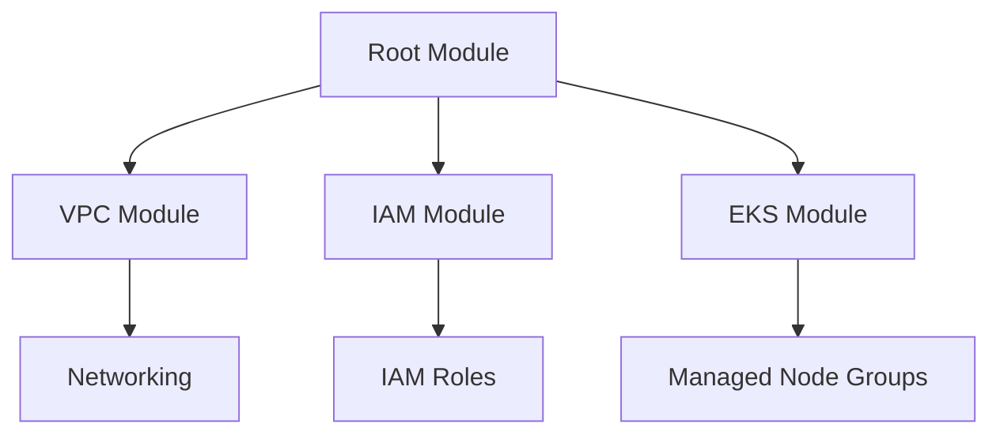
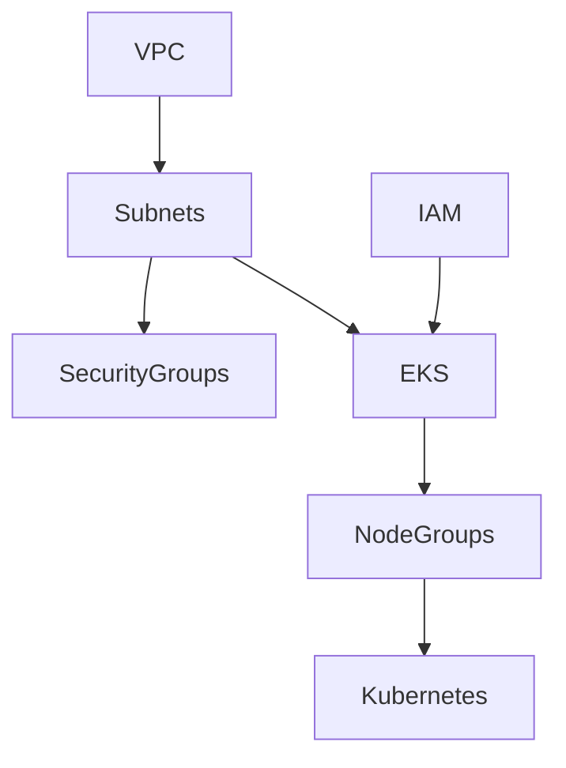
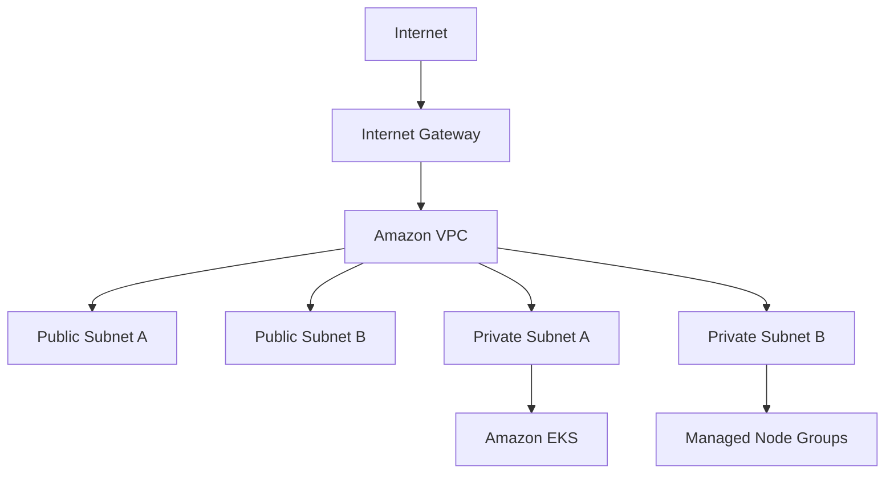
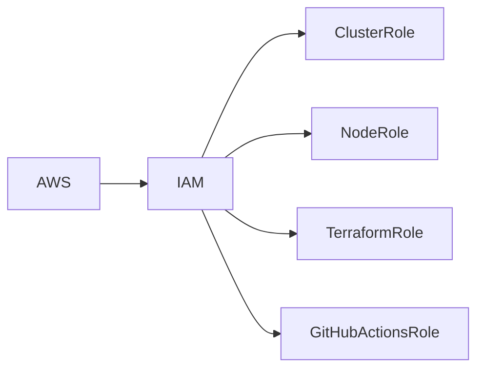
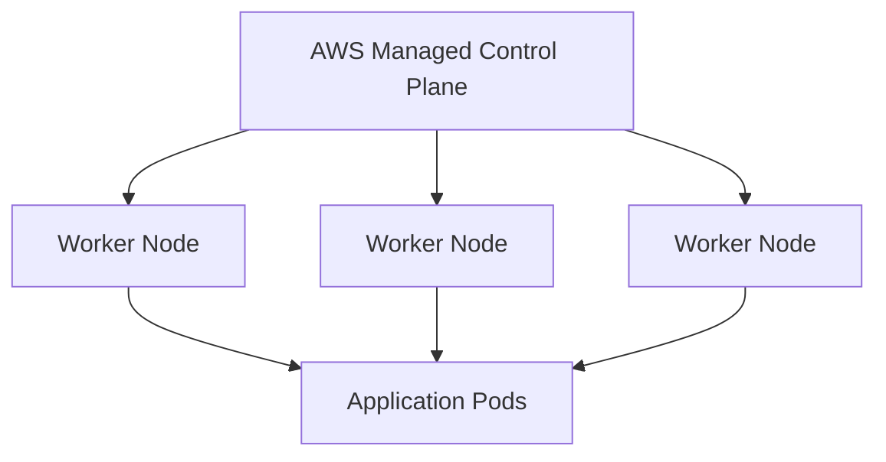
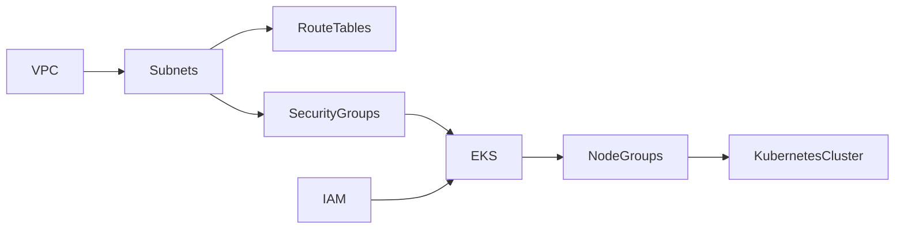

# Terraform Infrastructure

> This document describes the Infrastructure as Code (IaC) architecture used by the Valkyrie Platform. It explains how AWS infrastructure is provisioned, organized, and managed using Terraform.

---

# Table of Contents

1. Overview
2. Infrastructure Philosophy
3. Directory Structure
4. Module Architecture
5. Provider Configuration
6. State Management
7. Infrastructure Components
8. Dependency Graph
9. Best Practices

---

# Overview

Terraform is responsible for provisioning all cloud infrastructure required by Valkyrie before Kubernetes workloads are deployed.

Terraform manages:

- AWS networking
- Identity and Access Management (IAM)
- Amazon EKS
- Security Groups
- Node Groups
- Storage
- Supporting infrastructure

Kubernetes resources are intentionally excluded from Terraform after the cluster has been created. Those resources are managed through GitOps using Argo CD.

This separation provides a clear operational boundary:

| Terraform | Argo CD |
|------------|----------|
| Cloud Infrastructure | Kubernetes Resources |
| AWS Services | Platform Services |
| Networking | Applications |
| IAM | Helm Releases |
| EKS | Namespaces |

---

# Infrastructure Philosophy

The infrastructure layer follows several engineering principles.

## Declarative Infrastructure

Every cloud resource is described as code.

No AWS resource should be created manually.

Benefits include:

- Version control
- Peer review
- Repeatability
- Disaster recovery

---

## Modular Design

Rather than placing all resources inside a single Terraform configuration, infrastructure is divided into reusable modules.

Benefits:

- Reusability
- Reduced duplication
- Easier testing
- Independent evolution

---

## Immutable Infrastructure

Infrastructure changes are applied through Terraform rather than manual console modifications.

Changes follow this lifecycle:

```
Git Commit
      │
Terraform Plan
      │
Review
      │
Terraform Apply
      │
AWS
```

---

# Directory Structure

Example repository layout:

```text
infrastructure/

├── terraform/
│   ├── main.tf
│   ├── providers.tf
│   ├── variables.tf
│   ├── outputs.tf
│   ├── versions.tf
│   ├── backend.tf
│   └── terraform.tfvars
│
├── modules/
│   ├── vpc/
│   ├── eks/
│   ├── iam/
│   ├── networking/
│   ├── security-groups/
│   └── node-groups/
│
└── environments/
    ├── dev/
    ├── staging/
    └── production/
```

Each module encapsulates a single infrastructure concern.

---

# Module Architecture

Terraform modules are composed hierarchically.



This modular structure improves maintainability and enables future expansion without modifying unrelated infrastructure.

---

# Provider Configuration

Terraform uses the AWS provider to interact with cloud resources.

Example:

```hcl
provider "aws" {
  region = var.aws_region
}
```

Provider versions should be pinned to ensure consistent behavior across environments.

---

# Infrastructure Components

The root module provisions the following AWS resources.

| Component | Purpose |
|-----------|---------|
| VPC | Network isolation |
| Public Subnets | Internet-facing resources |
| Private Subnets | Kubernetes worker nodes |
| Internet Gateway | External connectivity |
| Route Tables | Traffic routing |
| Security Groups | Network security |
| IAM Roles | Authentication and authorization |
| Amazon EKS | Kubernetes control plane |
| Managed Node Groups | Kubernetes worker nodes |

---

# State Management

Terraform state represents the current infrastructure.

For collaborative environments, remote state is recommended.

Suggested backend:

- Amazon S3
- DynamoDB state locking

Benefits:

- Shared state
- Versioning
- Locking
- Recovery

Example backend configuration:

```hcl
terraform {
  backend "s3" {
    bucket         = "valkyrie-terraform-state"
    key            = "eks/terraform.tfstate"
    region         = "us-east-1"
    dynamodb_table = "terraform-locks"
  }
}
```

---

# Dependency Graph

Infrastructure resources have natural dependencies.



Terraform automatically determines resource ordering based on these dependencies.

---

# Best Practices

The following practices are recommended when working with Valkyrie's infrastructure.

- Review every `terraform plan` before applying.
- Store state remotely using S3.
- Enable DynamoDB locking to prevent concurrent modifications.
- Avoid manual changes in the AWS Console.
- Use modules to encapsulate infrastructure concerns.
- Pin provider versions.
- Keep variables environment-specific.
- Use descriptive outputs for downstream integrations.

---

# Documentation References

For additional information, refer to:

- `ARCHITECTURE.md`
- `DEPLOYMENT.md`
- `KUBERNETES.md`
- `GITOPS.md`

---
---

# VPC Architecture

Amazon VPC provides the networking foundation for the entire Valkyrie Platform.

The network is designed to isolate Kubernetes worker nodes while allowing secure communication with external services.



---

## Network Design Goals

The VPC architecture was designed with the following objectives:

- High availability across multiple Availability Zones
- Separation of public and private workloads
- Secure worker node networking
- Predictable routing
- Future support for multi-AZ scaling

---

# Public vs Private Subnets

The infrastructure separates internet-facing resources from internal workloads.

| Public Subnets | Private Subnets |
|----------------|-----------------|
| Internet Gateway | Worker Nodes |
| Load Balancers | Kubernetes Pods |
| NAT Gateway (optional) | Internal Services |
| Bastion Host (optional) | Platform Components |

This model minimizes the attack surface while allowing workloads to communicate externally when required.

---

# Security Groups

Network access is controlled through AWS Security Groups.

Typical rules include:

| Resource | Allowed Traffic |
|-----------|-----------------|
| Control Plane | Worker Nodes |
| Worker Nodes | Internal Cluster Traffic |
| Load Balancer | HTTP / HTTPS |
| Nodes | Outbound Internet (package downloads) |

Security Groups follow the principle of least privilege.

---

# IAM Architecture

Identity and access management is separated by responsibility.



Each IAM role has a clearly defined purpose.

| IAM Role | Responsibility |
|-----------|---------------|
| Terraform | Infrastructure provisioning |
| EKS Control Plane | Cluster management |
| Worker Nodes | Kubernetes workloads |
| GitHub Actions | CI/CD authentication |

Where supported, IAM Roles for Service Accounts (IRSA) are recommended to avoid distributing long-lived AWS credentials to Pods.

---

# Amazon EKS Cluster

Amazon EKS provides the managed Kubernetes control plane.

The control plane is managed by AWS while worker nodes remain under customer control.



Benefits include:

- Managed Kubernetes upgrades
- High availability
- Automatic control plane maintenance
- Native AWS integration

---

# Managed Node Groups

Worker nodes are provisioned through Amazon EKS Managed Node Groups.

Advantages include:

- Automated node lifecycle
- Rolling updates
- Auto-replacement of unhealthy nodes
- Simplified upgrades

Typical deployment:

| Availability Zone | Node Group |
|-------------------|------------|
| us-east-1a | Worker Group A |
| us-east-1b | Worker Group B |

Distributing worker nodes across Availability Zones improves fault tolerance.

---

# Terraform Variables

Infrastructure configuration is parameterized through variables.

Typical variables include:

| Variable | Purpose |
|-----------|---------|
| aws_region | Deployment region |
| cluster_name | EKS cluster name |
| vpc_cidr | VPC address space |
| public_subnets | Public subnet CIDRs |
| private_subnets | Private subnet CIDRs |
| node_instance_type | EC2 instance type |
| desired_capacity | Worker node count |

Parameterization enables the same infrastructure code to support multiple environments.

---

# Terraform Outputs

Outputs expose infrastructure information to downstream systems.

Examples include:

| Output | Description |
|---------|-------------|
| cluster_name | Amazon EKS cluster |
| cluster_endpoint | Kubernetes API endpoint |
| cluster_security_group | Cluster Security Group |
| node_group | Managed Node Group |
| vpc_id | VPC identifier |

Outputs simplify automation and integration with deployment pipelines.

---

# Resource Dependency Graph

Terraform automatically determines provisioning order through dependency analysis.



Understanding resource dependencies reduces deployment failures and simplifies troubleshooting.

---

# Cost Optimization

The reference environment prioritizes reproducibility while remaining mindful of cloud costs.

Considerations include:

- Managed Node Groups instead of self-managed EC2 instances
- Resource tagging for cost allocation
- Modular infrastructure to avoid over-provisioning
- Small instance sizes for development environments
- Separation of development and production configurations

Future enhancements may include:

- Karpenter
- Cluster Autoscaler
- Spot Instances
- Automated cost reporting

---

# Operational Considerations

Infrastructure changes should always follow this workflow.

```text
Git Commit
      │
Terraform Plan
      │
Peer Review
      │
Terraform Apply
      │
Infrastructure Validation
```

Direct modifications through the AWS Console are discouraged, as they introduce configuration drift.

---

# Common Operational Issues

| Issue | Cause | Resolution |
|-------|-------|------------|
| Terraform State Lock | Interrupted apply | Release DynamoDB lock after verification |
| Authentication Failure | Invalid AWS credentials | Verify IAM permissions and AWS CLI configuration |
| Node Join Failure | Missing IAM role or networking issue | Check EKS node IAM role and subnet configuration |
| EKS API Unreachable | kubeconfig mismatch | Regenerate kubeconfig using `aws eks update-kubeconfig` |
| Resource Drift | Manual console changes | Reconcile infrastructure through Terraform |

---

# Disaster Recovery

Infrastructure recovery is based on declarative provisioning.

Recovery workflow:

1. Restore Terraform state (if required).
2. Initialize the Terraform backend.
3. Execute `terraform plan`.
4. Apply the infrastructure.
5. Reconfigure `kubectl`.
6. Bootstrap GitOps.
7. Validate platform health.

Because the infrastructure is fully described as code, the environment can be recreated consistently without manual provisioning.

---

# Summary

Terraform provides the foundation of the Valkyrie Platform by provisioning AWS infrastructure in a repeatable and version-controlled manner.

By separating infrastructure management from Kubernetes application management, Valkyrie establishes a clear operational boundary:

- **Terraform** owns the cloud infrastructure.
- **Argo CD** owns Kubernetes resources.
- **Git** remains the single source of truth for both.

This separation improves maintainability, auditability, and operational consistency while reducing configuration drift across environments.

---
