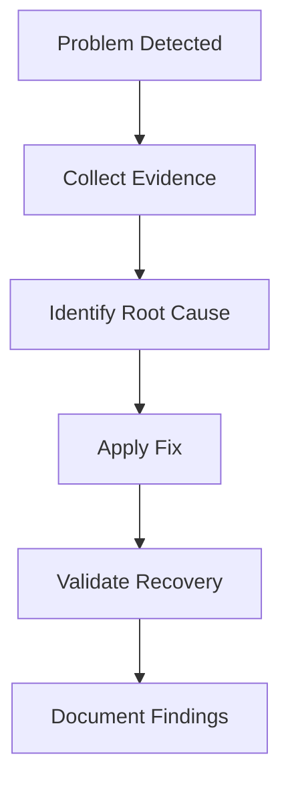

# Troubleshooting Guide

> This document provides operational runbooks for diagnosing and resolving common issues encountered while deploying and operating the Valkyrie Platform.

---

# Table of Contents

1. Philosophy
2. Troubleshooting Workflow
3. Platform Health Checklist
4. Infrastructure Issues
5. Kubernetes Issues
6. GitOps Issues
7. Monitoring Issues
8. Recovery Procedures

---

# Philosophy

Production incidents should be investigated systematically rather than through trial and error.

The troubleshooting workflow follows four steps:

1. Detect
2. Diagnose
3. Recover
4. Validate

Every issue should be investigated using telemetry rather than assumptions.

---

# Standard Troubleshooting Workflow



The goal is to restore service while understanding **why** the failure occurred.

---

# Platform Health Checklist

Before investigating individual components, verify overall platform health.

```bash
kubectl get nodes

kubectl get pods -A

kubectl get deployments -A

kubectl get svc -A

kubectl get ingress -A
```

Confirm:

- Nodes are **Ready**
- Pods are **Running**
- Deployments are **Available**
- Services are reachable
- No unexpected restarts

---

# Infrastructure Validation

Verify AWS identity.

```bash
aws sts get-caller-identity
```

Verify cluster access.

```bash
kubectl cluster-info
```

Verify kubeconfig.

```bash
kubectl config current-context
```

Verify Terraform state.

```bash
terraform state list
```

---

# Useful Diagnostic Commands

```bash
kubectl get all -A

kubectl describe pod <pod>

kubectl logs <pod>

kubectl logs -f <pod>

kubectl describe node <node>

kubectl get events \
--sort-by=.metadata.creationTimestamp
```

These commands should be your first step before making configuration changes.

---

# Incident Priorities

Prioritize issues by operational impact.

| Priority | Example |
|----------|---------|
| Critical | Cluster unavailable |
| High | Production application unavailable |
| Medium | Monitoring failure |
| Low | Dashboard issue |

Investigate high-impact failures first.

---

# Terraform Issues

## Terraform State Lock

### Symptoms

```
Error acquiring state lock
```

### Cause

Another Terraform operation is using the remote state.

### Diagnosis

```bash
terraform force-unlock <LOCK_ID>
```

### Resolution

Verify that no other Terraform process is running before releasing the lock.

Never force-unlock an active deployment.

---

## AWS Authentication Failure

### Symptoms

```
AccessDenied

ExpiredToken
```

### Diagnosis

```bash
aws sts get-caller-identity
```

### Resolution

Refresh AWS credentials and verify IAM permissions.

---

# Kubernetes Issues

## Node Not Ready

### Diagnosis

```bash
kubectl get nodes

kubectl describe node <node>
```

Check:

- Network connectivity
- Kubelet status
- Disk pressure
- Memory pressure

---

## Pod Pending

### Diagnosis

```bash
kubectl describe pod <pod>
```

Typical causes:

- Insufficient CPU
- Insufficient memory
- Missing Persistent Volume
- Node selector mismatch
- Taints

---

## CrashLoopBackOff

### Diagnosis

```bash
kubectl logs <pod>

kubectl describe pod <pod>
```

Common causes:

- Configuration errors
- Missing Secrets
- Application startup failure
- Incorrect image

---

# Recovery Checklist

Before closing an incident verify:

- Root cause identified
- Workload recovered
- Alerts cleared
- Metrics normalized
- Logs reviewed
- Documentation updated

Incident resolution is not complete until recovery has been verified.

---

# Deployment Failures

## ImagePullBackOff

### Symptoms

```text
STATUS: ImagePullBackOff
```

### Diagnosis

Describe the Pod.

```bash
kubectl describe pod <pod-name>
```

Check recent events.

```bash
kubectl get events \
--sort-by=.metadata.creationTimestamp
```

Verify image name.

```bash
kubectl get deployment <deployment> \
-o yaml
```

### Common Causes

- Incorrect image name
- Missing image tag
- Registry authentication failure
- Image not pushed
- Registry unavailable

### Resolution

- Verify the image exists.
- Confirm registry credentials.
- Push the missing image.
- Update the Deployment manifest.
- Synchronize Argo CD.

---

# OOMKilled

### Symptoms

```text
OOMKilled
```

### Diagnosis

```bash
kubectl describe pod <pod>
```

Check memory usage.

```bash
kubectl top pod
```

Review limits.

```bash
kubectl get deployment <deployment> \
-o yaml
```

### Root Causes

- Memory limit too low
- Memory leak
- Unexpected workload growth

### Resolution

Increase memory requests and limits only after confirming application behavior.

---

# Failed Deployment

### Symptoms

Deployment never reaches Available state.

### Diagnosis

```bash
kubectl rollout status deployment/<deployment>
```

Review ReplicaSets.

```bash
kubectl get rs
```

Inspect Pods.

```bash
kubectl get pods
```

### Resolution

Review:

- image
- configuration
- readiness probe
- liveness probe
- application logs

---

# Argo CD OutOfSync

### Symptoms

Application reports:

```
OutOfSync
```

### Diagnosis

```bash
kubectl get applications \
-n argocd
```

Inspect application.

```bash
kubectl describe application <application> \
-n argocd
```

Review Argo CD controller logs.

```bash
kubectl logs deployment/argocd-application-controller \
-n argocd
```

### Common Causes

- Manual kubectl changes
- Incorrect manifests
- Missing Git commit
- Failed synchronization

### Resolution

Restore Git as the source of truth.

Synchronize the application after verifying manifests.

---

# Argo CD Degraded

### Symptoms

```
Healthy: False
```

### Diagnosis

Inspect resources.

```bash
kubectl get pods -A
```

Review failing workload.

```bash
kubectl describe pod <pod>
```

### Resolution

Resolve workload failure before forcing synchronization.

---

# Prometheus Target Down

### Symptoms

Target status:

```
DOWN
```

### Diagnosis

Open Prometheus.

Navigate to:

```
Status

↓

Targets
```

Check:

- scrape endpoint
- Service
- Pod
- labels

### Resolution

Verify:

- Service endpoints
- annotations
- ports
- network connectivity

---

# Grafana Dashboard Empty

### Symptoms

No graphs displayed.

### Diagnosis

Verify datasource.

Open:

```
Connections

↓

Data Sources
```

Confirm:

- Prometheus reachable
- datasource healthy

### Resolution

Restart Grafana if necessary.

Verify Prometheus targets.

---

# Loki Not Receiving Logs

### Symptoms

No logs appear inside Grafana Explore.

### Diagnosis

Verify collector.

```bash
kubectl get pods \
-n monitoring
```

Review collector logs.

```bash
kubectl logs <collector-pod>
```

Verify Loki.

```bash
kubectl get svc \
-n monitoring
```

### Resolution

Confirm:

- collector configuration
- labels
- endpoints
- namespace selection

---

# Helm Deployment Failure

### Symptoms

Helm release reports:

```
FAILED
```

### Diagnosis

```bash
helm list -A
```

Inspect release.

```bash
helm status <release>
```

Review rendered manifests.

```bash
helm template
```

### Resolution

Correct chart values.

Upgrade the release.

```bash
helm upgrade
```

---

# Node Failure

### Symptoms

```
NotReady
```

### Diagnosis

```bash
kubectl get nodes
```

Describe node.

```bash
kubectl describe node <node>
```

Inspect events.

```bash
kubectl get events
```

### Resolution

Verify:

- EC2 instance
- kubelet
- networking
- IAM role
- disk usage

If necessary:

Replace the node using Managed Node Groups.

---

# High CPU Usage

### Diagnosis

```bash
kubectl top nodes

kubectl top pods
```

Determine:

- affected namespace
- affected deployment
- workload trend

### Resolution

Possible actions:

- optimize application
- increase replicas
- increase node capacity
- investigate abnormal traffic

---

# High Memory Usage

### Diagnosis

```bash
kubectl top pods
```

Inspect restart counts.

```bash
kubectl get pods
```

Review heap usage (application-specific).

### Resolution

- increase limits
- fix memory leak
- tune garbage collection
- optimize caching

---

# Incident Timeline

Every incident should record:

| Item | Example |
|------|----------|
| Detection Time | 14:05 UTC |
| Alert | High CPU |
| Impact | API latency |
| Root Cause | Memory leak |
| Resolution | Deployment rollback |
| Recovery Time | 8 minutes |

Maintaining an incident timeline improves future troubleshooting and post-incident analysis.

---

# Post-Incident Review

Every operational incident should conclude with a retrospective.

Document:

## Summary

What happened?

---

## Root Cause

Why did it happen?

---

## Impact

Who or what was affected?

---

## Resolution

How was the issue resolved?

---

## Preventive Actions

How can recurrence be prevented?

---

## Action Items

| Action | Owner | Status |
|---------|-------|--------|
| Improve alert threshold | Platform Team | Open |
| Update dashboard | SRE | Complete |
| Add runbook | DevOps | In Progress |

---

# Operational Principles

Effective troubleshooting is based on evidence rather than assumptions.

Recommended approach:

1. Observe
2. Collect evidence
3. Identify root cause
4. Apply the smallest safe fix
5. Verify recovery
6. Document findings

Following a repeatable process improves recovery time and reduces operational risk.

---

# Summary

Troubleshooting is a core operational capability of the Valkyrie Platform.

Rather than relying on ad hoc fixes, the platform emphasizes structured diagnostics, repeatable recovery procedures, and continuous operational improvement.

Runbooks, telemetry, GitOps, and Kubernetes self-healing work together to reduce Mean Time To Recovery (MTTR) and improve platform reliability.

---
